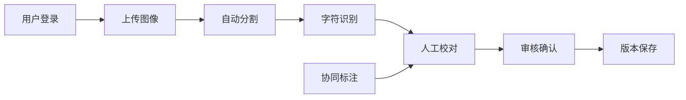
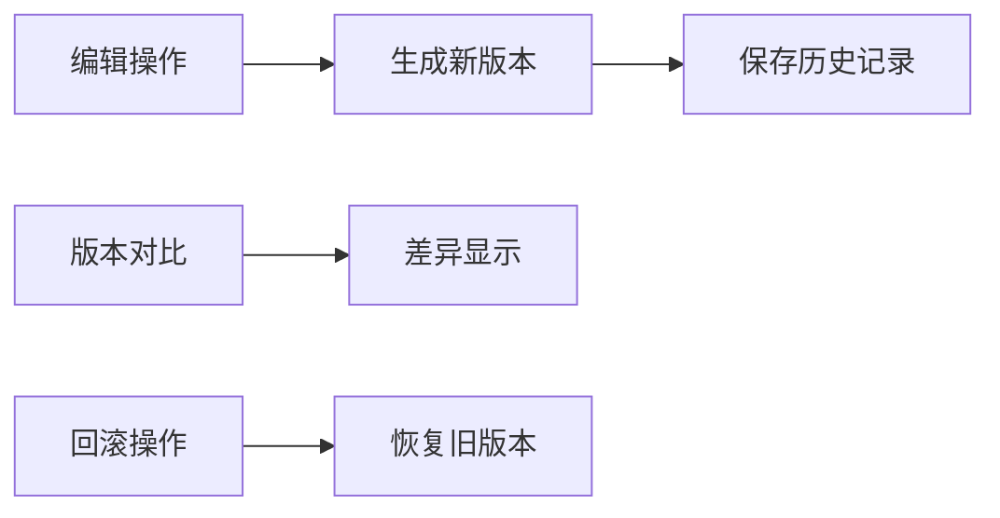

# 古籍碑文图像处理系统 PRD

## 1. 产品概述

古籍碑文图像处理系统是一个集图像上传、文字分割、字符识别、人工校对、多人协同标注、版本管理于一体的专业文物数字化平台。

- 主要目的：实现古籍碑文的数字化保存和文字识别与校对
- 解决问题：传统人工标注效率低、协同困难、版本管理混乱
- 目标用户：文物研究人员、图书馆、历史学者、古籍数字化团队
- 产品价值：加速古籍碑文数字化进程，提升标注质量和效率

## 2. 核心功能

### 2.1 用户角色

| 角色 | 注册方式 | 核心权限 |
|------|---------|---------|
| 管理员 | 系统创建 | 用户管理、系统配置、数据导出 |
| 标注员 | 管理员邀请 | 图像标注、字符校对、版本查看 |
| 审核员 | 管理员邀请 | 标注审核、版本确认、质量检查 |
| 访客 | 公开注册 | 浏览公开数据、查看标注结果 |

### 2.2 功能模块

1. **登录认证页**：用户登录、权限验证、会话管理
2. **仪表盘**：数据统计、任务列表、进度展示
3. **图像上传页**：古籍碑文图像上传、预览、元数据编辑
4. **标注工作台**：文字分割、字符识别、人工校对、协同标注
5. **版本管理页**：历史版本查看、对比、回滚
6. **项目管理页**：项目创建、成员管理、任务分配

### 2.3 页面详情

| 页面名称 | 模块名称 | 功能描述 |
|---------|---------|---------|
| 登录认证页 | 登录表单 | 用户名密码登录、记住密码、忘记密码 |
| 登录认证页 | 权限验证 | JWT令牌验证、角色权限检查 |
| 仪表盘 | 数据统计 | 上传数量、标注进度、识别准确率统计 |
| 仪表盘 | 任务列表 | 待处理任务、进行中任务、已完成任务 |
| 图像上传页 | 上传区域 | 拖拽上传、批量上传、上传进度显示 |
| 图像上传页 | 图像预览 | 缩略图预览、原图查看、元数据编辑 |
| 标注工作台 | 图像查看器 | 缩放、平移、旋转、对比度调节 |
| 标注工作台 | 文字分割 | 自动分割、手动调整、边界框编辑 |
| 标注工作台 | 字符识别 | OCR识别结果展示、识别置信度显示 |
| 标注工作台 | 人工校对 | 字符编辑、批量修改、校对标记 |
| 标注工作台 | 协同标注 | 实时同步、光标显示、在线用户列表 |
| 版本管理页 | 版本列表 | 历史版本、创建时间、作者信息 |
| 版本管理页 | 版本对比 | 差异高亮、并排对比、回滚操作 |
| 项目管理页 | 项目列表 | 项目创建、编辑、删除 |
| 项目管理页 | 成员管理 | 成员邀请、角色分配、权限设置 |

## 3. 核心流程

### 3.1 标注工作流程

用户上传古籍碑文图像后，系统自动进行文字分割和字符识别，标注员进行人工校对，审核员审核通过后完成标注。多人可同时在线协同标注，所有操作记录版本历史。

### 3.2 版本管理流程

每次标注操作生成新版本，支持版本对比和回滚。

## 4. 用户界面设计

### 4.1 设计风格

- **主色调**：深棕色 (#8B4513) - 体现古籍文物的历史厚重感
- **辅助色**：米黄色 (#F5F5DC) - 古籍纸张质感
- **强调色**：朱砂红 (#C41E3A) - 重要操作和提示
- **按钮风格**：圆角矩形，轻微阴影，悬停效果
- **字体**：标题使用宋体风格字体，正文使用清晰易读的无衬线字体
- **布局风格**：左侧导航栏 + 主内容区，卡片式布局
- **图标风格**：线性图标，古风元素，简洁明了

### 4.2 页面设计概览

| 页面名称 | 模块名称 | UI元素 |
|---------|---------|---------|
| 登录页 | 登录区域 | 居中卡片、木纹背景、古风装饰元素 |
| 标注工作台 | 图像区域 | 大图展示、工具栏、缩放控件 |
| 标注工作台 | 侧边栏 | 字符列表、属性面板、历史记录 |
| 版本管理页 | 对比区域 | 左右分栏、差异高亮、时间轴 |

### 4.3 响应式设计

- 桌面端优先设计
- 平板端适配：调整面板布局、触控优化
- 移动端：简化功能、核心功能保留

### 4.4 交互动效

- 页面加载：淡入动画
- 按钮悬停：轻微放大、阴影加深
- 标注操作：平滑过渡、反馈提示
- 协同光标：实时位置更新、颜色区分用户
