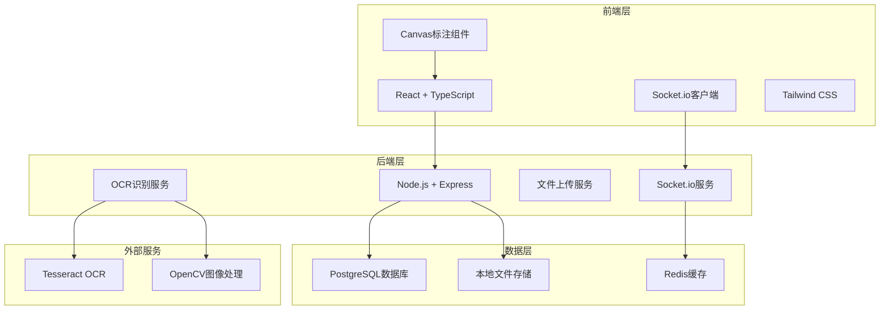
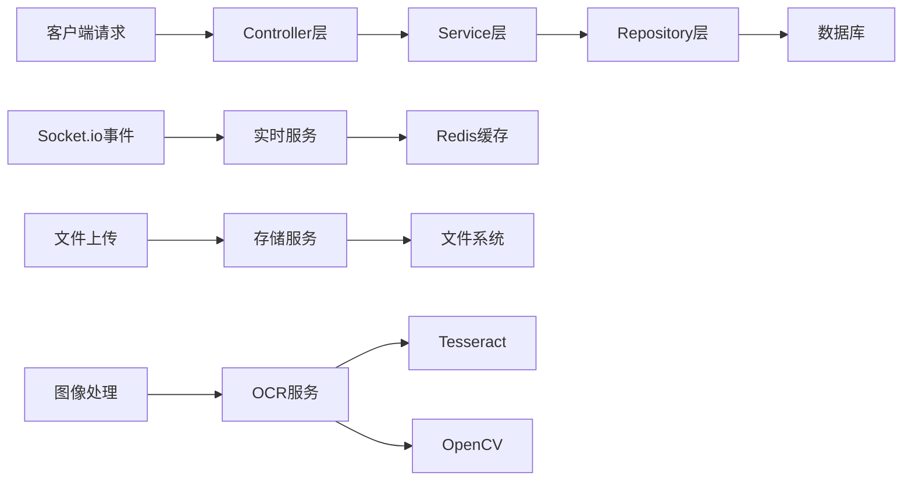
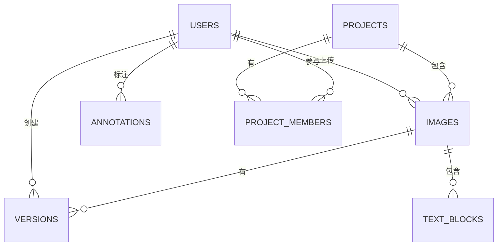

# 古籍碑文图像处理系统 技术架构

## 1. 架构设计



## 2. 技术选型说明

### 2.1 前端技术栈
- **框架**: React@18 + TypeScript
- **构建工具**: Vite
- **样式**: Tailwind CSS@3
- **状态管理**: Zustand
- **路由**: React Router DOM@6
- **协同**: Socket.io-client
- **图像标注**: HTML5 Canvas + Fabric.js

### 2.2 后端技术栈
- **框架**: Node.js + Express@4
- **实时通信**: Socket.io
- **身份验证**: JWT
- **文件上传**: Multer
- **图像处理**: Sharp + OpenCV4nodejs
- **OCR识别**: Tesseract.js

### 2.3 数据存储
- **数据库**: PostgreSQL
- **缓存**: Redis
- **文件存储**: 本地文件系统

## 3. 路由定义

| 路由路径 | 页面名称 | 说明 |
|---------|---------|------|
| /login | 登录页 | 用户登录认证 |
| /dashboard | 仪表盘 | 数据统计和任务列表 |
| /upload | 图像上传 | 古籍碑文图像上传 |
| /annotate/:imageId | 标注工作台 | 文字分割和字符标注 |
| /versions/:imageId | 版本管理 | 历史版本查看和对比 |
| /projects | 项目管理 | 项目列表和成员管理 |

## 4. API 接口定义

### 4.1 类型定义

```typescript
// 用户类型
interface User {
  id: string;
  username: string;
  role: 'admin' | 'annotator' | 'reviewer' | 'guest';
  avatar?: string;
  createdAt: Date;
}

// 图像类型
interface Image {
  id: string;
  name: string;
  url: string;
  thumbnailUrl: string;
  width: number;
  height: number;
  uploadedBy: string;
  projectId: string;
  status: 'uploaded' | 'segmented' | 'recognized' | 'reviewing' | 'completed';
  createdAt: Date;
  updatedAt: Date;
}

// 文字块
interface TextBlock {
  id: string;
  imageId: string;
  x: number;
  y: number;
  width: number;
  height: number;
  recognizedText?: string;
  correctedText?: string;
  confidence?: number;
  status: 'pending' | 'confirmed' | 'rejected';
  annotatedBy?: string;
}

// 版本
interface Version {
  id: string;
  imageId: string;
  versionNumber: number;
  authorId: string;
  authorName: string;
  comment?: string;
  data: TextBlock[];
  createdAt: Date;
}
```

### 4.2 API 端点

| 方法 | 路径 | 说明 | 请求体 | 响应体 |
|------|------|------|--------|--------|
| POST | /api/auth/login | 用户登录 | {username, password} | {token, user} |
| GET | /api/images | 获取图像列表 | - | Image[] |
| POST | /api/images | 上传图像 | FormData | Image |
| GET | /api/images/:id | 获取图像详情 | - | Image |
| POST | /api/images/:id/segment | 自动分割 | - | TextBlock[] |
| POST | /api/images/:id/recognize | 字符识别 | - | TextBlock[] |
| GET | /api/images/:id/blocks | 获取文字块 | - | TextBlock[] |
| PUT | /api/blocks/:id | 更新文字块 | {correctedText, status} | TextBlock |
| POST | /api/images/:id/versions | 创建版本 | {comment, data} | Version |
| GET | /api/images/:id/versions | 获取版本列表 | - | Version[] |
| GET | /api/versions/:id | 获取版本详情 | - | Version |
| POST | /api/versions/:id/rollback | 版本回滚 | - | Version |

## 5. 服务端架构



## 6. 数据模型

### 6.1 ER 图



### 6.2 数据库DDL

```sql
-- 用户表
CREATE TABLE users (
  id UUID PRIMARY KEY DEFAULT gen_random_uuid(),
  username VARCHAR(50) UNIQUE NOT NULL,
  password_hash VARCHAR(255) NOT NULL,
  role VARCHAR(20) NOT NULL DEFAULT 'guest',
  avatar VARCHAR(255),
  created_at TIMESTAMP DEFAULT CURRENT_TIMESTAMP,
  updated_at TIMESTAMP DEFAULT CURRENT_TIMESTAMP
);

-- 项目表
CREATE TABLE projects (
  id UUID PRIMARY KEY DEFAULT gen_random_uuid(),
  name VARCHAR(100) NOT NULL,
  description TEXT,
  created_by UUID REFERENCES users(id),
  created_at TIMESTAMP DEFAULT CURRENT_TIMESTAMP,
  updated_at TIMESTAMP DEFAULT CURRENT_TIMESTAMP
);

-- 项目成员表
CREATE TABLE project_members (
  id UUID PRIMARY KEY DEFAULT gen_random_uuid(),
  project_id UUID REFERENCES projects(id) ON DELETE CASCADE,
  user_id UUID REFERENCES users(id) ON DELETE CASCADE,
  role VARCHAR(20) NOT NULL DEFAULT 'annotator',
  joined_at TIMESTAMP DEFAULT CURRENT_TIMESTAMP,
  UNIQUE(project_id, user_id)
);

-- 图像表
CREATE TABLE images (
  id UUID PRIMARY KEY DEFAULT gen_random_uuid(),
  name VARCHAR(255) NOT NULL,
  original_name VARCHAR(255),
  file_path VARCHAR(255) NOT NULL,
  thumbnail_path VARCHAR(255),
  width INTEGER,
  height INTEGER,
  file_size INTEGER,
  project_id UUID REFERENCES projects(id) ON DELETE CASCADE,
  uploaded_by UUID REFERENCES users(id),
  status VARCHAR(20) DEFAULT 'uploaded',
  created_at TIMESTAMP DEFAULT CURRENT_TIMESTAMP,
  updated_at TIMESTAMP DEFAULT CURRENT_TIMESTAMP
);

-- 文字块表
CREATE TABLE text_blocks (
  id UUID PRIMARY KEY DEFAULT gen_random_uuid(),
  image_id UUID REFERENCES images(id) ON DELETE CASCADE,
  x INTEGER NOT NULL,
  y INTEGER NOT NULL,
  width INTEGER NOT NULL,
  height INTEGER NOT NULL,
  recognized_text TEXT,
  corrected_text TEXT,
  confidence FLOAT,
  status VARCHAR(20) DEFAULT 'pending',
  annotated_by UUID REFERENCES users(id),
  created_at TIMESTAMP DEFAULT CURRENT_TIMESTAMP,
  updated_at TIMESTAMP DEFAULT CURRENT_TIMESTAMP
);

-- 版本表
CREATE TABLE versions (
  id UUID PRIMARY KEY DEFAULT gen_random_uuid(),
  image_id UUID REFERENCES images(id) ON DELETE CASCADE,
  version_number INTEGER NOT NULL,
  author_id UUID REFERENCES users(id),
  author_name VARCHAR(50),
  comment TEXT,
  data JSONB NOT NULL,
  created_at TIMESTAMP DEFAULT CURRENT_TIMESTAMP,
  UNIQUE(image_id, version_number)
);

-- 索引
CREATE INDEX idx_text_blocks_image_id ON text_blocks(image_id);
CREATE INDEX idx_versions_image_id ON versions(image_id);
CREATE INDEX idx_images_project_id ON images(project_id);
```
