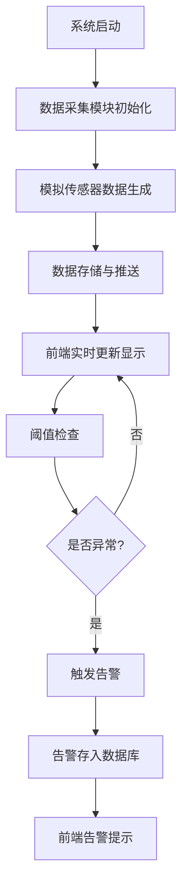

## 1. 产品概述

发酵监控系统是一款工业级实时数据监测平台，用于监控发酵过程中的温度、湿度、氧浓度等关键参数，支持实时曲线展示、异常告警和历史数据查询，帮助操作人员及时发现并处理生产过程中的异常情况。

## 2. 核心功能

### 2.1 用户角色

| 角色 | 登录方式 | 核心权限 |
|------|----------|----------|
| 操作员 | 账号密码登录 | 查看实时数据、监控曲线、告警信息、历史数据查询 |

### 2.2 功能模块

1. **实时监控面板**：数据采集显示、实时曲线图、告警状态指示
2. **异常告警中心**：告警列表、告警级别、告警处理状态
3. **历史数据查询**：时间范围筛选、数据导出、趋势分析

### 2.3 页面详情

| 页面名称 | 模块名称 | 功能描述 |
|-----------|-------------|---------------------|
| 监控控制台 | 数据概览卡片 | 显示温度、湿度、氧浓度、发酵时间实时数值 |
| 监控控制台 | 实时曲线图 | 多参数实时趋势曲线，支持缩放、暂停/继续 |
| 监控控制台 | 告警提示条 | 顶部滚动显示最新告警信息 |
| 告警中心 | 告警列表 | 按时间倒序显示所有告警，支持筛选 |
| 历史查询 | 数据查询面板 | 选择时间范围、参数类型，查询历史数据 |

## 3. 核心流程

## 4. 用户界面设计

### 4.1 设计风格

- **主色调**：深蓝色系 (#165DFF)，体现科技感和专业感
- **辅助色**：绿色 (#00B42A) 表示正常，橙色 (#FF7D00) 表示警告，红色 (#F53F3F) 表示严重
- **中性色**：深灰背景 (#0F172A)，浅灰文字 (#94A3B8)
- **按钮风格**：圆角8px，悬停时有阴影和颜色渐变效果
- **字体**：使用现代无衬线字体，标题字号18-24px，正文字号14px
- **布局风格**：卡片式布局，网格系统，左侧导航 + 右侧内容区
- **图标风格**：线性图标，使用lucide-react图标库

### 4.2 页面设计概览

| 页面名称 | 模块名称 | UI元素 |
|-----------|-------------|-------------|
| 监控控制台 | 数据概览 | 圆角卡片、渐变背景、数值动画、状态指示灯 |
| 监控控制台 | 实时曲线 | Recharts折线图、多色曲线、时间轴、交互提示 |
| 告警中心 | 告警列表 | 表格布局、告警级别色标、状态徽章 |
| 历史查询 | 查询面板 | 日期选择器、下拉筛选、数据表格 |

### 4.3 响应式设计

- 桌面端优先设计，支持1920×1080及以上分辨率
- 中等屏幕适配：1280px-1919px，调整卡片间距和图表大小
- 平板及移动端：1024px以下，垂直堆叠布局，优化触控区域
