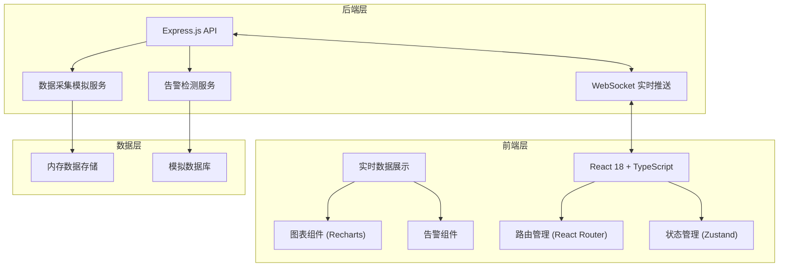
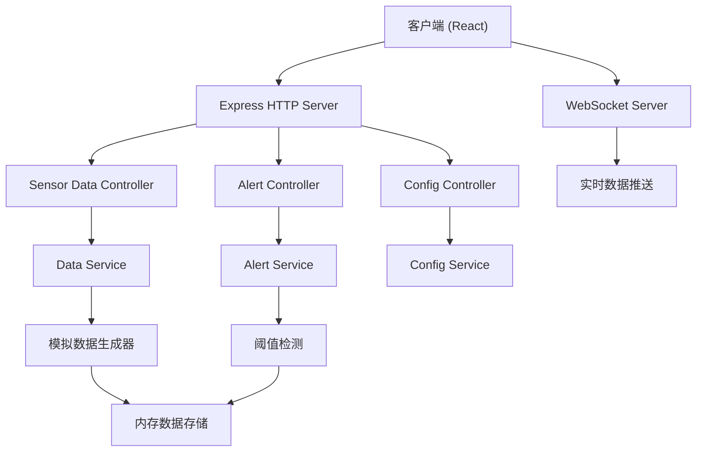
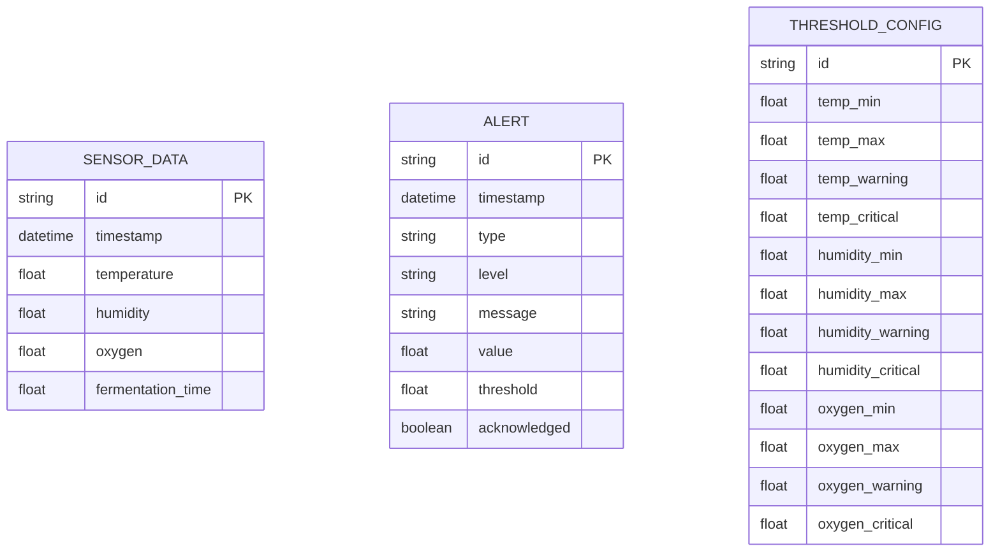

## 1. 架构设计



## 2. 技术描述

- **前端**: React@18 + TypeScript + Vite + TailwindCSS@3 + Zustand + Recharts + lucide-react
- **初始化工具**: vite-init
- **后端**: Express@4 + WebSocket (ws库)
- **数据库**: 内存存储 + 本地JSON文件（演示用）
- **图表库**: Recharts
- **图标库**: lucide-react

## 3. 路由定义

| 路由 | 页面名称 | 功能描述 |
|-------|---------|----------|
| /dashboard | 监控控制台 | 实时数据展示、曲线图、告警提示 |
| /alerts | 告警中心 | 告警列表、告警筛选、状态管理 |
| /history | 历史查询 | 时间范围选择、历史数据展示 |

## 4. API 定义

### 4.1 数据类型定义

```typescript
// 传感器数据
interface SensorData {
  id: string;
  timestamp: Date;
  temperature: number;      // 温度 (℃)
  humidity: number;         // 湿度 (%)
  oxygen: number;           // 氧浓度 (%)
  fermentationTime: number; // 发酵时间 (小时)
}

// 告警数据
interface Alert {
  id: string;
  timestamp: Date;
  type: 'temperature' | 'humidity' | 'oxygen';
  level: 'warning' | 'critical';
  message: string;
  value: number;
  threshold: number;
  acknowledged: boolean;
}

// 阈值配置
interface ThresholdConfig {
  temperature: { min: number; max: number; warning: number; critical: number };
  humidity: { min: number; max: number; warning: number; critical: number };
  oxygen: { min: number; max: number; warning: number; critical: number };
}
```

### 4.2 API 端点

| 方法 | 路径 | 描述 |
|------|------|------|
| GET | /api/sensor/current | 获取当前传感器数据 |
| GET | /api/sensor/history | 获取历史数据（支持时间参数） |
| GET | /api/alerts | 获取告警列表 |
| PUT | /api/alerts/:id/acknowledge | 确认告警 |
| GET | /api/config/thresholds | 获取阈值配置 |
| PUT | /api/config/thresholds | 更新阈值配置 |

## 5. 服务器架构



## 6. 数据模型

### 6.1 数据模型定义



### 6.2 阈值配置

```json
{
  "temperature": {
    "min": 20,
    "max": 45,
    "warning": 38,
    "critical": 42
  },
  "humidity": {
    "min": 40,
    "max": 90,
    "warning": 80,
    "critical": 85
  },
  "oxygen": {
    "min": 5,
    "max": 25,
    "warning": 8,
    "critical": 6
  }
}
```
