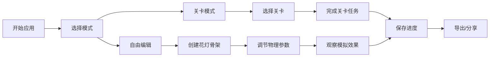

# 花灯骨架编辑器 - 产品需求文档

## 1. 产品概述
花灯骨架编辑器是一款交互式物理模拟应用，用户可以创建和编辑花灯骨架结构，观察节点受力、悬挂效果和风力响应。应用包含关卡系统和存档管理，适合用于创意设计和物理教学演示。
- 核心目标：提供直观的骨架编辑工具和真实的物理模拟体验
- 目标用户：创意设计师、教育工作者、物理爱好者

## 2. 核心功能

### 2.1 用户角色
| 角色 | 注册方式 | 核心权限 |
|------|----------|----------|
| 普通用户 | 无需注册 | 使用所有编辑功能、创建关卡、保存/加载存档 |

### 2.2 功能模块
1. **编辑器主页面**：画布编辑、工具栏、属性面板
2. **物理模拟**：节点受力计算、悬挂模拟、风力响应
3. **关卡系统**：关卡选择、任务目标、进度保存
4. **存档管理**：保存/加载项目、导出配置

### 2.3 页面详情
| 页面名称 | 模块名称 | 功能描述 |
|-----------|-------------|---------------------|
| 主编辑器 | 画布区域 | 点击创建节点、拖拽连接节点、选择删除元素 |
| 主编辑器 | 工具栏 | 节点工具、连接工具、选择工具、删除工具 |
| 主编辑器 | 物理控制面板 | 重力调节、风力调节、暂停/播放模拟 |
| 关卡选择 | 关卡列表 | 显示可用关卡、解锁状态、完成度 |
| 存档管理 | 存档列表 | 保存当前状态、加载历史存档、删除存档 |

## 3. 核心流程

## 4. 用户界面设计

### 4.1 设计风格
- **主色调**：中国红 (#C41E3A)、金色 (#D4AF37)、深木色 (#3E2723)
- **辅助色**：暖黄 (#FFB74D)、宣纸白 (#FAFAFA)
- **按钮风格**：圆角中式按钮、悬停有金色光晕
- **字体**：标题使用书法风格字体，正文使用现代无衬线字体
- **布局风格**：分栏布局，左侧工具栏、中央画布、右侧属性面板
- **装饰元素**：中式边框纹样、祥云背景纹理

### 4.2 页面设计概览
| 页面名称 | 模块名称 | UI 元素 |
|-----------|-------------|----------|
| 主编辑器 | 画布区域 | 深色宣纸背景、节点为金色圆点、连线为红色线条、悬停高亮 |
| 主编辑器 | 工具栏 | 垂直工具栏、图标按钮、选中状态高亮 |
| 主编辑器 | 属性面板 | 卡片式布局、滑块控件、数值输入、实时数据显示 |
| 关卡选择 | 关卡卡片 | 中式卡片设计、锁图标、星级评分 |
| 存档管理 | 存档列表 | 时间戳显示、预览缩略图、操作按钮组 |

### 4.3 响应式设计
- 桌面端优先设计（1920×1080）
- 平板端自适应布局，工具栏可折叠
- 移动端简化界面，优先保证画布操作空间

### 4.4 动画效果
- 节点创建：弹性缩放动画
- 物理模拟：平滑的位置过渡、受力可视化
- 风力效果：粒子飘散动画、线条摆动效果
- 页面切换：淡入淡出过渡
