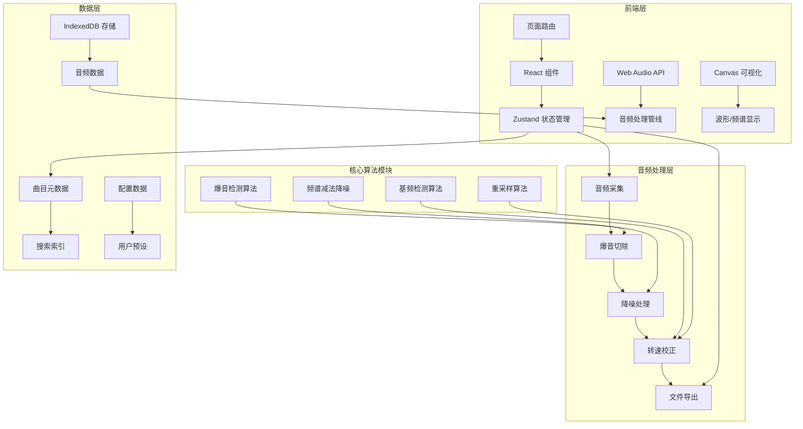

# 唱机音频处理系统 - 技术架构文档

## 1. 架构设计


## 2. 技术描述
- **前端框架**：React@18 + TypeScript
- **构建工具**：Vite@5
- **样式方案**：TailwindCSS@3
- **状态管理**：Zustand
- **路由**：react-router-dom@6
- **音频处理**：Web Audio API + DSP.js
- **数据存储**：IndexedDB (dexie.js)
- **可视化**：Canvas API + Chart.js
- **图标库**：lucide-react
- **后端**：无（纯前端应用）

## 3. 路由定义
| 路由 | 用途 |
|-------|---------|
| / | 音频采集/处理主页 |
| /library | 曲目库管理页面 |
| /settings | 设置页面 |

## 4. 数据模型

### 4.1 核心数据类型

```typescript
// 音频轨道数据
interface AudioTrack {
  id: string;
  name: string;
  artist?: string;
  album?: string;
  duration: number;
  sampleRate: number;
  channels: number;
  audioData: Float32Array[]; // 每通道的PCM数据
  waveformData: number[]; // 缩略图波形数据
  createdAt: number;
  updatedAt: number;
  metadata: TrackMetadata;
  processingHistory: ProcessingStep[];
}

// 曲目元数据
interface TrackMetadata {
  genre?: string;
  year?: number;
  trackNumber?: number;
  coverArt?: string; // base64 或 URL
  comments?: string;
  bpm?: number;
  key?: string;
}

// 处理历史记录
interface ProcessingStep {
  type: 'click_removal' | 'noise_reduction' | 'speed_correction' | 'normalization';
  timestamp: number;
  params: Record<string, any>;
  duration: number; // 处理耗时
}

// 音频处理参数
interface ProcessingParams {
  clickRemoval: {
    enabled: boolean;
    threshold: number; // 0-100
    sensitivity: number; // 0-100
  };
  noiseReduction: {
    enabled: boolean;
    strength: number; // 0-100
    noiseFloor: number; // 自动检测或手动设置
  };
  speedCorrection: {
    enabled: boolean;
    targetSpeed: number; // 目标转速百分比 90-110%
    preservePitch: boolean;
  };
  normalization: {
    enabled: boolean;
    targetLevel: number; // dB
  };
}

// 采集状态
interface RecordingState {
  isRecording: boolean;
  isPaused: boolean;
  startTime: number;
  duration: number;
  inputDevice: string;
  sampleRate: number;
  level: number; // 当前录音电平 0-1
}

// 导出配置
interface ExportConfig {
  format: 'wav' | 'mp3' | 'flac';
  bitDepth: 16 | 24 | 32;
  sampleRate: number;
  quality: number; // 0-100 for MP3
}
```

## 5. 项目结构

```
src/
├── components/
│   ├── audio/
│   │   ├── WaveformViewer.tsx    # 波形显示组件
│   │   ├── SpectrumAnalyzer.tsx  # 频谱分析器
│   │   ├── RecordingControls.tsx # 录音控制
│   │   └── LevelMeter.tsx        # 电平表
│   ├── processing/
│   │   ├── ClickRemovalPanel.tsx   # 爆音切除面板
│   │   ├── NoiseReductionPanel.tsx # 降噪面板
│   │   ├── SpeedCorrectionPanel.tsx # 转速校正面板
│   │   └── ProcessingQueue.tsx     # 处理队列
│   ├── library/
│   │   ├── TrackList.tsx         # 曲目列表
│   │   ├── TrackCard.tsx         # 曲目卡片
│   │   ├── TrackEditor.tsx       # 元数据编辑器
│   │   └── SearchBar.tsx         # 搜索栏
│   └── common/
│       ├── PlayerControls.tsx    # 播放控制
│       ├── ExportDialog.tsx      # 导出对话框
│       └── SettingsPanel.tsx     # 设置面板
├── hooks/
│   ├── useAudioRecorder.ts       # 录音钩子
│   ├── useAudioPlayer.ts         # 播放钩子
│   ├── useAudioProcessor.ts      # 音频处理钩子
│   └── useWaveformRenderer.ts    # 波形渲染钩子
├── store/
│   ├── useAudioStore.ts          # 音频状态
│   ├── useLibraryStore.ts        # 曲目库状态
│   └── useSettingsStore.ts       # 设置状态
├── audio/
│   ├── recorder.ts               # 录音核心逻辑
│   ├── player.ts                 # 播放器核心逻辑
│   ├── dsp/
│   │   ├── clickRemoval.ts       # 爆音切除算法
│   │   ├── noiseReduction.ts     # 降噪算法
│   │   ├── speedCorrection.ts    # 转速校正算法
│   │   ├── pitchDetection.ts     # 基频检测
│   │   └── resample.ts           # 重采样算法
│   └── formats/
│       ├── wav.ts                # WAV 编码/解码
│       ├── mp3.ts                # MP3 编码
│       └── flac.ts               # FLAC 编码
├── utils/
│   ├── math.ts                   # 数学工具
│   ├── fft.ts                    # FFT 实现
│   ├── storage.ts                # IndexedDB 封装
│   └── waveform.ts               # 波形生成工具
├── pages/
│   ├── AudioProcessor.tsx        # 音频处理主页
│   ├── Library.tsx               # 曲目库页面
│   └── Settings.tsx              # 设置页面
├── App.tsx
├── main.tsx
└── index.css
```

## 6. 核心算法设计

### 6.1 爆音切除算法 (Click Removal)

**原理**：
- 爆音表现为短时、高幅度的脉冲信号
- 使用中值滤波检测异常点
- 线性插值修复受影响的样本

**算法流程**：
```
1. 对输入信号进行中值滤波 (窗口大小 7-15)
2. 计算原始信号与滤波后信号的差值
3. 超过阈值的点标记为爆音点
4. 对检测到的爆音区域进行插值修复
5. 可选：多遍处理以提高效果
```

**参数**：
- 阈值 (Threshold): 控制检测灵敏度
- 窗口大小: 中值滤波窗口

### 6.2 降噪算法 (Noise Reduction)

**原理**：频谱减法降噪
- 估计噪声频谱（静音段）
- 从信号频谱中减去噪声频谱
- 使用过减因子和谱下限控制音乐噪声

**算法流程**：
```
1. 噪声估计：分析静音段获取噪声频谱
2. 分帧加窗：对信号进行 STFT 变换
3. 频谱减法：|Y| = |X| - α * |N|
4. 谱下限：确保 |Y| ≥ β * |X|
5. 逆 STFT：使用相位重建时域信号
6. 重叠相加：合成最终输出
```

### 6.3 转速校正算法 (Speed Correction)

**原理**：
- 检测参考音高（如钢琴标准音 A4 = 440Hz）
- 计算实际转速与标准转速的偏差
- 使用相位声码器进行变速不变调处理

**算法流程**：
```
1. 检测已知频率的参考信号
2. 计算频率偏差 ratio = detected / expected
3. 使用相位声码器按 ratio 缩放时长
4. 重采样到原始时长实现转速校正
5. 可选：不保持音高的简单重采样
```

### 6.4 基频检测 (Pitch Detection)

**算法**：YAAPT 或自相关法
- 对信号进行自相关计算
- 寻找峰值位置对应基频周期
- 使用抛物线插值提高精度

## 7. 音频处理管线

```
输入源 → 录音 → 预处理 → 爆音检测 → 降噪 → 转速校正 → 归一化 → 导出
                          ↓
                    波形可视化
                    频谱分析
                    实时预览
```

## 8. 性能优化

- **Web Workers**: 将音频处理放在后台线程
- **分块处理**: 大文件分段处理，避免内存溢出
- **增量渲染**: 波形数据按需渲染
- **缓存策略**: 处理结果缓存，支持撤销/重做
- **内存管理**: 及时释放大型音频数据

## 9. 浏览器兼容性

- Web Audio API: Chrome/Edge 92+, Firefox 91+, Safari 14.1+
- IndexedDB: 所有现代浏览器
- Web Workers: 所有现代浏览器
- MediaRecorder: Chrome 49+, Firefox 25+, Safari 14.1+
