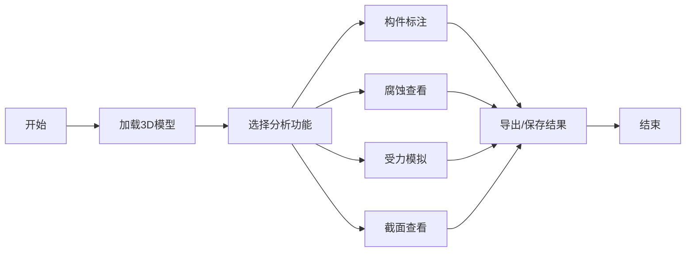

## 1. 产品概述
工程结构3D可视化分析平台，面向建筑、机械、桥梁等工程领域，提供模型加载、构件标注、腐蚀查看、受力模拟、截面查看五大核心功能，帮助工程师直观分析结构状态。

- 解决传统工程分析缺乏直观3D交互的问题
- 目标用户：结构工程师、设计师、检测人员

## 2. 核心功能

### 2.1 功能模块
1. **主界面**：3D视口、功能工具栏、属性面板
2. **模型加载**：支持多种3D模型格式导入
3. **构件标注**：对结构构件进行标签和注释
4. **腐蚀查看**：展示结构腐蚀区域和程度
5. **受力模拟**：可视化结构受力分布和形变
6. **截面查看**：剖切模型查看内部结构

### 2.2 功能详情
| 功能名称 | 模块名称 | 功能描述 |
|----------|----------|----------|
| 模型加载 | 文件导入 | 支持GLB、GLTF等格式，显示加载进度 |
| 构件标注 | 标注系统 | 点击构件添加文字标签，支持编辑删除 |
| 腐蚀查看 | 腐蚀渲染 | 颜色映射显示腐蚀程度，支持透明度调节 |
| 受力模拟 | 应力分析 | 热力图显示应力分布，动画展示形变 |
| 截面查看 | 剖切工具 | X/Y/Z三轴剖切，可调整截面位置 |

## 3. 核心流程
用户进入应用后，首先加载3D模型，然后根据分析需求选择对应功能模块。各功能可切换使用，支持同时查看多维度分析结果。

## 4. 用户界面设计

### 4.1 设计风格
- **主色调**：深蓝(#165DFF)作为主色，代表专业和科技感
- **辅助色**：橙色(#FF7D00)用于强调交互，绿色(#00B42A)表示安全状态，红色(#F53F3F)表示危险状态
- **背景**：深灰色(#1D2129)专业深色背景，减少视觉疲劳
- **按钮风格**：圆角8px，轻微悬浮效果
- **字体**：Inter - 现代无衬线字体，适合工程应用
- **布局**：三栏布局 - 左侧工具栏、中央3D视口、右侧属性面板
- **图标风格**：简洁线性图标，使用SVG确保清晰度

### 4.2 页面设计
| 页面名称 | 模块名称 | UI元素 |
|----------|----------|--------|
| 主界面 | 3D视口 | 全屏幕渲染，轨道控制器，网格辅助线 |
| 主界面 | 工具栏 | 垂直图标按钮，功能切换高亮 |
| 主界面 | 属性面板 | 可折叠面板，滑块控制，数值输入 |

### 4.3 响应式
桌面端优先设计，1920x1080为基准分辨率，支持窗口大小自适应。

### 4.4 3D场景指导
- **环境**：深色Studio环境，HDRI提供柔和反射
- **光照**：三光源设置 - 主方向光、环境光、补光
- **相机**：透视相机，初始距离适中，可自由旋转缩放
- **交互**：鼠标左键旋转，右键平移，滚轮缩放
- **后期**：抗锯齿，轻微泛光提升科技感
- **性能**：目标60FPS，模型面数优化
