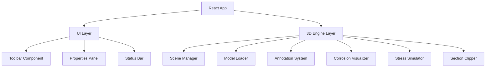

## 1. 架构设计



## 2. 技术说明

- **前端框架**: React@18 + TypeScript
- **构建工具**: Vite@5
- **样式方案**: TailwindCSS@3
- **3D引擎**: Three.js + @react-three/fiber + @react-three/drei
- **状态管理**: Zustand
- **图标**: 无后端，纯前端应用

## 3. 路由定义

| 路由 | 用途 |
|------|------|
| / | 主应用界面 |

## 4. 数据模型

### 4.1 应用状态

```typescript
interface AppState {
  activeTool: 'model' | 'annotation' | 'corrosion' | 'stress' | 'section' | null;
  model: {
    loaded: boolean;
    url: string;
  };
  annotations: Annotation[];
  corrosion: {
    enabled: boolean;
    intensity: number;
  };
  stress: {
    enabled: boolean;
    animationSpeed: number;
  };
  section: {
    enabled: boolean;
    axis: 'x' | 'y' | 'z';
    position: number;
  };
}

interface Annotation {
  id: string;
  position: [number, number, number];
  text: string;
  color: string;
}
```

## 5. 目录结构

```
src/
├── components/
│   ├── Toolbar.tsx
│   ├── PropertiesPanel.tsx
│   ├── StatusBar.tsx
│   └── Viewport.tsx
├── store/
│   └── useStore.ts
├── types/
│   └── index.ts
├── App.tsx
├── main.tsx
└── index.css
```
