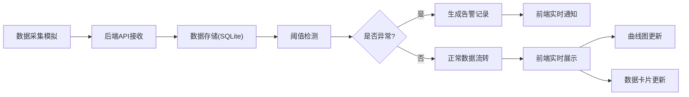

## 1. 产品概述

物联网环境监控系统，实现温湿度、盐度、pH值的实时采集、可视化监控与异常告警。
- 核心功能：多参数环境数据采集、实时曲线展示、异常告警通知、历史数据查询
- 目标用户：环境监测人员、实验室研究员、工业控制操作员

## 2. 核心功能

### 2.1 功能模块

1. **实时监控面板**：数据概览卡片、实时数值显示、状态指示器
2. **实时曲线图**：多参数折线图、实时更新、交互式缩放
3. **异常告警中心**：阈值配置、告警列表、告警统计、实时通知
4. **历史数据查询**：时间范围筛选、数据表格、趋势分析、数据导出

### 2.2 页面详情

| 页面名称 | 模块名称 | 功能描述 |
|---------|---------|---------|
| 监控仪表盘 | 数据卡片 | 显示温度、湿度、盐度、pH值实时数值及状态 |
| 监控仪表盘 | 实时曲线 | 实时绘制四参数变化曲线，支持单独查看 |
| 告警中心 | 告警列表 | 显示历史告警记录，支持按类型/时间筛选 |
| 告警中心 | 阈值配置 | 可设置各参数告警上下限阈值 |
| 历史查询 | 数据表格 | 分页展示历史数据，支持时间范围筛选 |
| 历史查询 | 趋势分析 | 统计时段内最大值、最小值、平均值 |

## 3. 核心流程

## 4. 用户界面设计

### 4.1 设计风格
- **主色调**：深蓝 #165DFF（科技感、专业）
- **辅助色**：翠绿 #00B42A（正常）、橙色 #FF7D00（警告）、红色 #F53F3F（异常）
- **中性色**：深灰 #1D2129、中灰 #4E5969、浅灰 #C9CDD4
- **按钮风格**：圆角 8px，悬停阴影效果
- **字体**：Inter（现代无衬线字体），标题字重 600，正文字重 400
- **布局风格**：卡片式布局，网格系统，左侧导航 + 右侧内容区
- **图标风格**：Lucide 线性图标，简洁专业

### 4.2 页面设计概览

| 页面名称 | 模块名称 | UI 元素 |
|---------|---------|--------|
| 监控仪表盘 | 数据卡片 | 渐变背景、数值大字体显示、状态指示灯、趋势箭头 |
| 监控仪表盘 | 实时曲线 | Chart.js 折线图、多颜色系列、图例切换、平滑动画 |
| 告警中心 | 告警列表 | 时间轴样式、严重程度颜色标记、操作按钮 |
| 告警中心 | 阈值配置 | 滑块控件、数值输入、保存按钮 |
| 历史查询 | 数据表格 | 斑马纹样式、固定表头、排序功能 |
| 历史查询 | 筛选器 | 日期选择器、下拉菜单、搜索框 |

### 4.3 响应式设计
- Desktop-first 设计，适配 1440px 以上屏幕
- 平板端（768px-1440px）：导航折叠，卡片自动换行
- 移动端（<768px）：单列布局，汉堡菜单，简化图表显示

