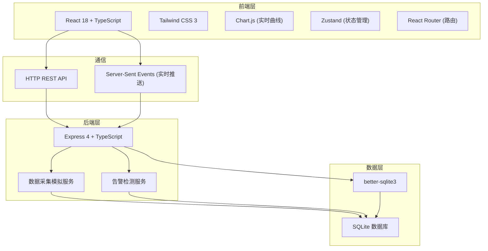
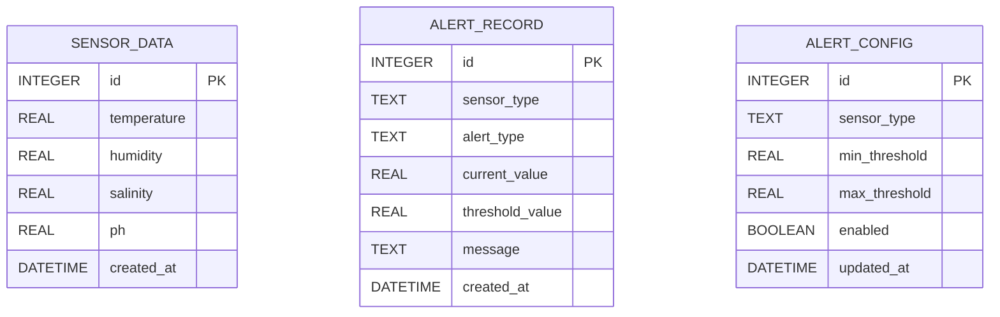

## 1. 架构设计



## 2. 技术描述

- **前端**: React@18 + TypeScript + Tailwindcss@3 + Vite + Zustand + Chart.js + React Router
- **后端**: Express@4 + TypeScript
- **数据库**: SQLite (better-sqlite3)
- **实时通信**: Server-Sent Events (SSE)
- **初始化工具**: vite-init

## 3. 路由定义

| 前端路由 | 页面 | 用途 |
|---------|------|------|
| /dashboard | 监控仪表盘 | 实时数据展示、曲线图 |
| /alerts | 告警中心 | 告警列表、阈值配置 |
| /history | 历史查询 | 历史数据表格、趋势分析 |

| 后端 API | 方法 | 用途 |
|---------|------|------|
| /api/sensor/latest | GET | 获取最新传感器数据 |
| /api/sensor/history | GET | 获取历史数据（带时间范围参数） |
| /api/sensor/data | POST | 提交传感器数据（模拟采集用） |
| /api/alerts | GET | 获取告警列表 |
| /api/alerts/config | GET/PUT | 获取/更新告警阈值配置 |
| /api/sse/events | GET | SSE 实时事件流 |

## 4. 数据模型

### 4.1 数据模型定义



### 4.2 数据库初始化脚本

```sql
-- 传感器数据表
CREATE TABLE IF NOT EXISTS sensor_data (
    id INTEGER PRIMARY KEY AUTOINCREMENT,
    temperature REAL NOT NULL,
    humidity REAL NOT NULL,
    salinity REAL NOT NULL,
    ph REAL NOT NULL,
    created_at DATETIME DEFAULT CURRENT_TIMESTAMP
);

-- 告警记录表
CREATE TABLE IF NOT EXISTS alert_records (
    id INTEGER PRIMARY KEY AUTOINCREMENT,
    sensor_type TEXT NOT NULL,
    alert_type TEXT NOT NULL,
    current_value REAL NOT NULL,
    threshold_value REAL NOT NULL,
    message TEXT NOT NULL,
    created_at DATETIME DEFAULT CURRENT_TIMESTAMP
);

-- 告警配置表
CREATE TABLE IF NOT EXISTS alert_config (
    id INTEGER PRIMARY KEY AUTOINCREMENT,
    sensor_type TEXT UNIQUE NOT NULL,
    min_threshold REAL NOT NULL,
    max_threshold REAL NOT NULL,
    enabled BOOLEAN DEFAULT 1,
    updated_at DATETIME DEFAULT CURRENT_TIMESTAMP
);

-- 初始化默认告警配置
INSERT OR IGNORE INTO alert_config (sensor_type, min_threshold, max_threshold, enabled) VALUES
    ('temperature', -10, 50, 1),
    ('humidity', 0, 100, 1),
    ('salinity', 0, 50, 1),
    ('ph', 0, 14, 1);

-- 创建索引
CREATE INDEX IF NOT EXISTS idx_sensor_data_created_at ON sensor_data(created_at DESC);
CREATE INDEX IF NOT EXISTS idx_alert_records_created_at ON alert_records(created_at DESC);
```

## 5. 类型定义

```typescript
// 传感器数据类型
export interface SensorData {
    id: number;
    temperature: number;
    humidity: number;
    salinity: number;
    ph: number;
    created_at: string;
}

// 告警记录类型
export interface AlertRecord {
    id: number;
    sensor_type: string;
    alert_type: 'low' | 'high';
    current_value: number;
    threshold_value: number;
    message: string;
    created_at: string;
}

// 告警配置类型
export interface AlertConfig {
    id: number;
    sensor_type: string;
    min_threshold: number;
    max_threshold: number;
    enabled: boolean;
    updated_at: string;
}

// 实时事件类型
export interface SSEEvent {
    type: 'sensor_update' | 'alert';
    data: SensorData | AlertRecord;
    timestamp: string;
}
```

