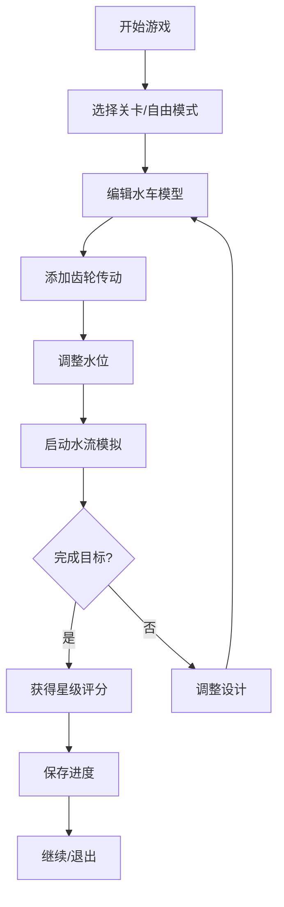

## 1. 产品概述
水车物理模拟器是一款基于Web的交互式物理模拟游戏，用户可以编辑水车模型、观察水流动力、体验齿轮传动效果、控制水位变化、挑战不同关卡并保存游戏进度。
- 主要目的：提供教育性的物理力学模拟体验，让用户直观理解水能转换和机械传动原理
- 目标用户：学生、物理爱好者、游戏玩家

## 2. 核心功能

### 2.1 功能模块
1. **主界面**：游戏画布、工具栏、属性面板
2. **水车编辑器**：水车部件创建、修改、删除、旋转
3. **水流模拟**：动态水流效果、冲击力计算
4. **齿轮传动**：齿轮啮合、转速传递、扭矩计算
5. **水位控制**：水位升降调节、水源控制
6. **关卡系统**：多关卡挑战、目标任务、星级评分
7. **存档系统**：本地保存/加载、进度管理

### 2.2 页面详情
| 页面名称 | 模块名称 | 功能描述 |
|---------|---------|---------|
| 主游戏页 | 画布区域 | Canvas渲染3D/2D场景，实时物理模拟 |
| 主游戏页 | 工具栏 | 选择工具、水车部件、齿轮部件、删除工具 |
| 主游戏页 | 属性面板 | 显示选中物体属性，调整参数 |
| 主游戏页 | 水位控制 | 滑块控制水位高度，开关水源 |
| 主游戏页 | 关卡选择 | 关卡列表、难度选择、进度显示 |
| 主游戏页 | 存档管理 | 保存当前状态、加载存档、删除存档 |

## 3. 核心流程
用户进入游戏后，首先选择关卡或自由模式，在编辑器中搭建水车和齿轮系统，调整水位启动水流，观察水车运转效果，完成关卡目标后获得评分，可随时保存当前进度。

## 4. 用户界面设计

### 4.1 设计风格
- **主色调**：蓝色系(#165DFF)代表水，棕色系(#8B4513)代表木头，灰色系(#6B7280)代表金属齿轮
- **按钮风格**：圆角8px，悬停有缩放效果，按下有凹陷感
- **字体**：标题使用Orbitron（科技感），正文使用Roboto（清晰易读）
- **布局风格**：左侧工具栏，中间画布，右侧属性面板，底部状态栏
- **图标风格**：使用emoji和SVG图标，具有工业复古风格

### 4.2 页面设计概述
| 页面名称 | 模块名称 | UI元素 |
|---------|---------|--------|
| 主游戏页 | 画布区域 | 深蓝色背景，水波纹动画，水车转动动画 |
| 主游戏页 | 工具栏 | 垂直排列工具按钮，选中高亮显示 |
| 主游戏页 | 属性面板 | 卡片式布局，滑块控件，数值输入 |
| 主游戏页 | 水位控制 | 垂直水位指示器，平滑过渡动画 |
| 主游戏页 | 关卡弹窗 | 模态框，关卡卡片，星级展示 |

### 4.3 响应性
- 桌面端优先，支持1920x1080及以上分辨率
- 画布区域自适应窗口大小
- 移动端可简化布局，工具栏转为水平排列

### 4.4 2D场景指导
- 背景：渐变蓝色天空，底部水域
- 光照：顶部光源，水车有投影效果
- 动画：水流粒子效果，水车转动，齿轮啮合
- 粒子：水滴飞溅，气泡上升效果
