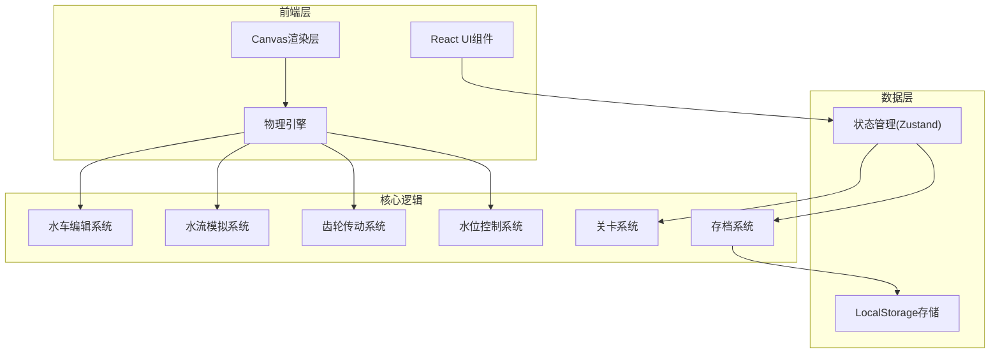

## 1. 架构设计



## 2. 技术描述
- **前端框架**：React@18 + TypeScript + Vite
- **样式方案**：TailwindCSS@3
- **状态管理**：Zustand
- **图形渲染**：Canvas 2D API
- **物理引擎**：自定义轻量级物理系统
- **图标**：React Icons
- **存储**：LocalStorage本地存储

## 3. 目录结构

```
src/
├── components/          # React组件
│   ├── Toolbar.tsx      # 工具栏
│   ├── PropertyPanel.tsx # 属性面板
│   ├── WaterLevelControl.tsx # 水位控制
│   ├── LevelSelector.tsx # 关卡选择
│   └── SaveManager.tsx   # 存档管理
├── canvas/              # Canvas渲染相关
│   ├── Renderer.ts      # 主渲染器
│   ├── WaterRenderer.ts # 水流渲染
│   ├── WheelRenderer.ts # 水车渲染
│   └── GearRenderer.ts  # 齿轮渲染
├── physics/             # 物理引擎
│   ├── PhysicsEngine.ts # 物理引擎
│   ├── WaterFlow.ts     # 水流模拟
│   ├── GearSystem.ts    # 齿轮传动
│   └── WaterLevel.ts    # 水位控制
├── store/               # 状态管理
│   └── useGameStore.ts  # 游戏状态
├── types/               # TypeScript类型
│   └── index.ts         # 类型定义
├── levels/              # 关卡配置
│   └── levels.ts        # 关卡数据
├── utils/               # 工具函数
│   └── saveUtils.ts     # 存档工具
└── App.tsx              # 主应用
```

## 4. 路由定义
| 路由 | 用途 |
|-----|------|
| / | 主游戏页面 |

## 5. 数据模型

### 5.1 核心数据类型

```typescript
// 基础物体
interface BaseObject {
  id: string;
  x: number;
  y: number;
  rotation: number;
  type: 'waterwheel' | 'gear' | 'waterSource' | 'dam';
}

// 水车
interface WaterWheel extends BaseObject {
  radius: number;
  bladeCount: number;
  angularVelocity: number;
  angularAcceleration: number;
}

// 齿轮
interface Gear extends BaseObject {
  radius: number;
  teeth: number;
  angularVelocity: number;
  connectedTo: string[];
}

// 水源
interface WaterSource extends BaseObject {
  flowRate: number;
  width: number;
  active: boolean;
}

// 水位
interface WaterLevel {
  height: number;
  targetHeight: number;
  maxHeight: number;
  minHeight: number;
}

// 关卡
interface Level {
  id: number;
  name: string;
  description: string;
  targetRPM: number;
  timeLimit: number;
  initialObjects: BaseObject[];
  stars: { rpm: number; time: number }[];
}

// 存档
interface SaveData {
  id: string;
  name: string;
  timestamp: number;
  levelId: number;
  objects: BaseObject[];
  waterLevel: WaterLevel;
  score: number;
}
```

### 5.2 物理引擎接口

```typescript
interface IPhysicsEngine {
  addObject(obj: BaseObject): void;
  removeObject(id: string): void;
  update(deltaTime: number): void;
  calculateWaterForce(wheel: WaterWheel, waterLevel: WaterLevel): number;
  calculateGearTransmission(gear1: Gear, gear2: Gear): number;
}
```
