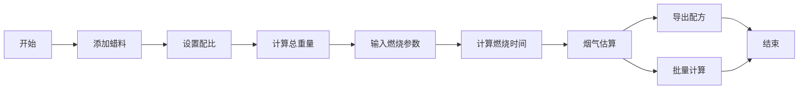

## 1. 产品概述

蜡料配比计算系统是一个专业的蜡烛制作配方管理工具，帮助用户精确计算蜡料配比、预测燃烧时间、估算烟气排放量，并支持配方导出和批量计算功能。

- 主要用途：蜡烛制作配方设计与优化
- 目标用户：蜡烛制造商、手工艺人、DIY爱好者
- 产品价值：提高配方精度，优化燃烧效果，降低试验成本

## 2. 核心功能

### 2.1 用户角色

| 角色 | 注册方式 | 核心权限 |
|------|----------|----------|
| 普通用户 | 无需注册 | 使用所有计算功能，导出配方 |

### 2.2 功能模块

1. **蜡料配比计算**：多种蜡料混合比例计算，百分比自动调整
2. **燃烧时间计算**：基于蜡料类型、蜡芯尺寸、容器规格预测燃烧时间
3. **烟气估算**：根据配方成分估算燃烧时的烟气排放量
4. **配方导出**：将计算完成的配方导出为JSON或CSV格式
5. **批量计算**：支持同时计算多个配方，批量生成结果

### 2.3 页面详情

| 页面名称 | 模块名称 | 功能描述 |
|----------|----------|----------|
| 主页 | 蜡料配比模块 | 添加/删除蜡料，设置比例，实时计算总重量 |
| 主页 | 燃烧时间模块 | 输入蜡芯参数、容器参数，计算燃烧时间 |
| 主页 | 烟气估算模块 | 基于配方成分计算烟气排放指数 |
| 主页 | 批量计算模块 | 导入多个配方，批量计算结果 |
| 主页 | 配方导出模块 | 选择导出格式，下载配方文件 |

## 3. 核心流程

用户进入系统后，首先在蜡料配比区域添加各种蜡料并设置比例，系统自动计算总重量和各成分百分比。然后切换到燃烧时间计算模块，输入蜡芯类型、尺寸和容器信息，系统预测燃烧时长。接着可以查看烟气估算结果，了解配方的环保性能。最后可以选择导出单个配方或使用批量计算功能处理多个配方。

## 4. 用户界面设计

### 4.1 设计风格

- **主色调**：琥珀色渐变（#f59e0b 到 #d97706），代表温暖和蜡烛的火焰
- **辅助色**：深灰色（#374151）用于文本，浅米色（#fef3c7）用于背景
- **按钮风格**：圆角设计，悬停时有轻微上浮效果和阴影变化
- **字体**：标题使用 Noto Serif SC，正文使用 Noto Sans SC
- **布局风格**：卡片式布局，各功能模块独立成卡，支持折叠展开
- **图标风格**：使用线条型图标，颜色与主色调一致

### 4.2 页面设计概览

| 页面名称 | 模块名称 | UI元素 |
|----------|----------|--------|
| 主页 | 导航栏 | Logo、功能切换标签、主题切换按钮 |
| 主页 | 蜡料配比卡片 | 添加按钮、蜡料列表、比例滑块、重量输入框 |
| 主页 | 燃烧时间卡片 | 下拉选择器、数字输入框、计算结果展示 |
| 主页 | 烟气估算卡片 | 进度条展示、环保等级标签、详细数据表格 |
| 主页 | 批量计算卡片 | 文件上传区域、批量结果列表、全选操作 |
| 主页 | 导出区域 | 格式选择、下载按钮、预览功能 |

### 4.3 响应式设计

- 桌面端：三列网格布局，各卡片独立分布
- 平板端：两列布局，适当调整卡片宽度
- 移动端：单列垂直布局，优化触摸区域，按钮尺寸不小于48px

### 4.4 交互动效

- 页面加载时卡片依次淡入，带有轻微上浮动画
- 数值变化时数字平滑过渡
- 滑块拖动时有实时反馈
- 导出成功时有成功提示动画
