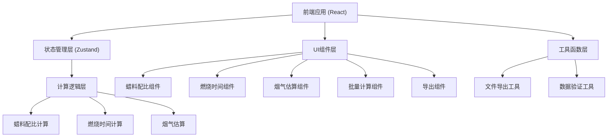
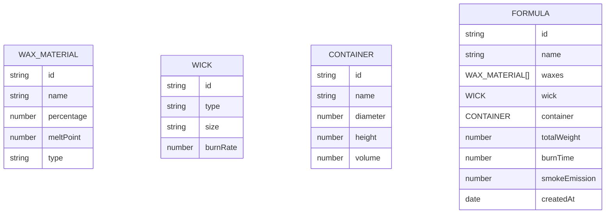

## 1. 架构设计



## 2. 技术选型说明

- **前端框架**: React@18 + TypeScript
- **构建工具**: Vite
- **样式方案**: TailwindCSS@3
- **状态管理**: Zustand
- **图标库**: Lucide React
- **后端**: 无（纯前端应用）
- **数据库**: 无（本地存储使用 localStorage）

## 3. 路由定义

| 路由 | 用途 |
|------|------|
| / | 主页，包含所有计算功能 |

## 4. 数据模型

### 4.1 数据模型定义



### 4.2 TypeScript 类型定义

```typescript
// 蜡料类型
interface WaxMaterial {
  id: string;
  name: string;
  percentage: number;
  meltPoint: number;
  type: 'soy' | 'paraffin' | 'beeswax' | 'palm' | 'gel' | 'coconut';
}

// 蜡芯类型
interface Wick {
  id: string;
  type: string;
  size: string;
  burnRate: number;
}

// 容器类型
interface Container {
  id: string;
  name: string;
  diameter: number;
  height: number;
  volume: number;
}

// 配方类型
interface Formula {
  id: string;
  name: string;
  waxes: WaxMaterial[];
  wick: Wick;
  container: Container;
  totalWeight: number;
  burnTime: number;
  smokeEmission: number;
  createdAt: string;
}

// 计算结果类型
interface CalculationResult {
  burnTime: number;
  smokeEmission: number;
  ecoScore: 'A' | 'B' | 'C' | 'D' | 'E';
}
```

## 5. 核心计算逻辑

### 5.1 蜡料配比计算
- 总重量 = Σ(各蜡料重量)
- 各蜡料百分比 = (蜡料重量 / 总重量) × 100%

### 5.2 燃烧时间计算
燃烧时间 = (总重量 × 蜡料燃烧系数) / (蜡芯燃烧速率 × 容器系数)

### 5.3 烟气估算
烟气排放指数基于以下因素加权计算：
- 石蜡含量：正相关
- 蜂蜡/大豆蜡含量：负相关
- 添加剂含量：正相关

## 6. 项目结构

```
src/
├── components/
│   ├── WaxRatioCalculator.tsx
│   ├── BurnTimeCalculator.tsx
│   ├── SmokeEstimator.tsx
│   ├── BatchCalculator.tsx
│   ├── FormulaExporter.tsx
│   └── shared/
│       ├── Card.tsx
│       ├── Input.tsx
│       └── Button.tsx
├── store/
│   └── useFormulaStore.ts
├── utils/
│   ├── calculations.ts
│   ├── export.ts
│   └── validation.ts
├── types/
│   └── index.ts
├── App.tsx
└── main.tsx
```
