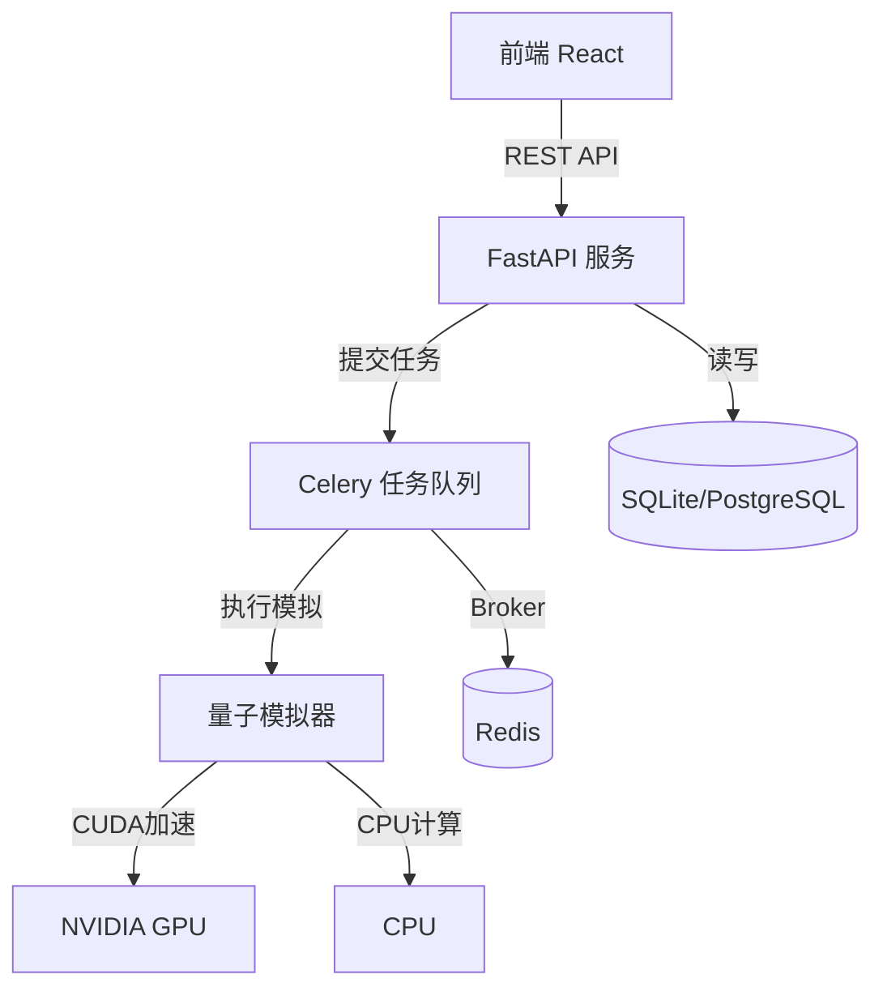
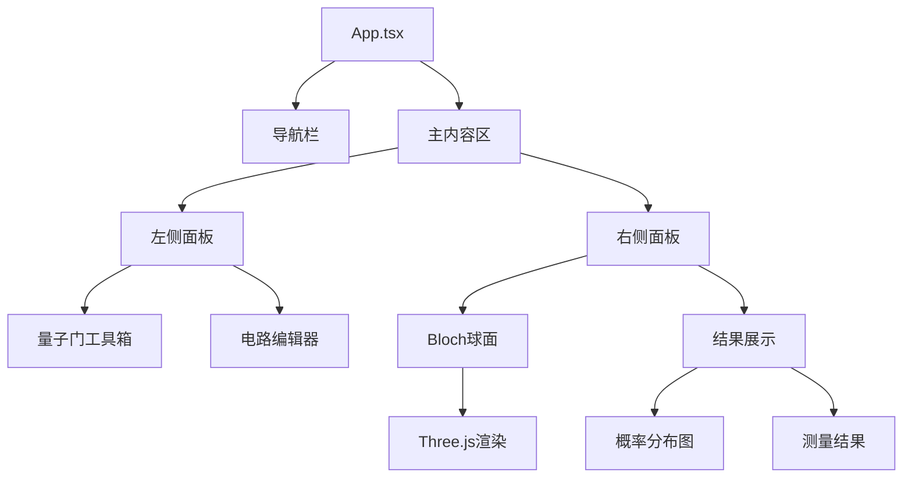

# 量子计算模拟器 - 技术架构文档

## 1. 系统架构总览

### 1.1 整体架构图


### 1.2 技术栈选型

| 层级 | 技术选型 | 版本 | 说明 |
|------|---------|------|------|
| 前端框架 | React + TypeScript | 18.x | 组件化开发 |
| 3D渲染 | Three.js | 0.160.x | Bloch球面可视化 |
| 构建工具 | Vite | 5.x | 快速开发构建 |
| 后端框架 | FastAPI | 0.109.x | 高性能API服务 |
| 任务队列 | Celery | 5.3.x | 异步任务处理 |
| 消息代理 | Redis | 7.x | Celery broker |
| 数据库 | SQLite/PostgreSQL | - | 数据持久化 |
| ORM | SQLAlchemy | 2.0.x | 数据库操作 |
| 数值计算 | NumPy | 1.26.x | CPU矩阵运算 |
| GPU加速 | CuPy | 13.x | CUDA矩阵运算 |

## 2. 目录结构设计

```
p139/
├── backend/
│   ├── app/
│   │   ├── __init__.py
│   │   ├── main.py              # FastAPI入口
│   │   ├── api/                 # API路由
│   │   │   ├── __init__.py
│   │   │   ├── circuits.py      # 电路管理API
│   │   │   └── jobs.py          # 任务管理API
│   │   ├── core/                # 核心配置
│   │   │   ├── __init__.py
│   │   │   ├── config.py        # 配置管理
│   │   │   └── database.py      # 数据库连接
│   │   ├── models/              # 数据模型
│   │   │   ├── __init__.py
│   │   │   ├── circuit.py       # 电路模型
│   │   │   └── job.py           # 任务模型
│   │   ├── schemas/             # Pydantic模式
│   │   │   ├── __init__.py
│   │   │   ├── circuit.py
│   │   │   └── job.py
│   │   ├── services/            # 业务逻辑
│   │   │   ├── __init__.py
│   │   │   ├── circuit_service.py
│   │   │   └── job_service.py
│   │   └── worker/              # Celery worker
│   │       ├── __init__.py
│   │       ├── celery_app.py    # Celery配置
│   │       └── tasks.py         # 任务定义
│   ├── quantum/                  # 量子模拟器核心
│   │   ├── __init__.py
│   │   ├── simulator.py         # 模拟器主类
│   │   ├── gates.py             # 量子门定义
│   │   ├── state.py             # 量子态操作
│   │   ├── cuda_backend.py      # CUDA后端
│   │   └── cpu_backend.py       # CPU后端
│   ├── requirements.txt
│   └── .env
├── frontend/
│   ├── src/
│   │   ├── main.tsx
│   │   ├── App.tsx
│   │   ├── components/
│   │   │   ├── BlochSphere/     # Bloch球面组件
│   │   │   │   ├── index.tsx
│   │   │   │   └── BlochSphere.ts
│   │   │   ├── CircuitEditor/   # 电路编辑器组件
│   │   │   │   ├── index.tsx
│   │   │   │   ├── GateToolbox.tsx
│   │   │   │   └── CircuitCanvas.tsx
│   │   │   ├── Results/          # 结果展示组件
│   │   │   │   ├── ProbabilityChart.tsx
│   │   │   │   └── MeasurementResult.tsx
│   │   │   └── common/
│   │   ├── services/             # API服务
│   │   │   ├── api.ts
│   │   │   └── jobService.ts
│   │   ├── store/                # 状态管理
│   │   │   └── useCircuitStore.ts
│   │   ├── types/                # TypeScript类型
│   │   │   └── index.ts
│   │   └── styles/
│   ├── package.json
│   ├── tsconfig.json
│   ├── vite.config.ts
│   └── index.html
└── README.md
```

## 3. 后端详细设计

### 3.1 量子模拟器核心架构

#### 3.1.1 量子态表示
```python
# 量子态使用复数向量表示
# n qubits -> 2^n 维复数向量

# |ψ⟩ = α₀|00...0⟩ + α₁|00...1⟩ + ... + α_{2ⁿ-1}|11...1⟩
```

#### 3.1.2 量子门矩阵表示
```python
# H门 (Hadamard):
H = 1/√2 * [[1, 1],
            [1, -1]]

# CNOT门:
CNOT = [[1, 0, 0, 0],
        [0, 1, 0, 0],
        [0, 0, 0, 1],
        [0, 0, 1, 0]]

# Toffoli门 (CCNOT):
# 8x8矩阵，控制位都为1时翻转目标位
```

#### 3.1.3 模拟器类设计
```python
class QuantumSimulator:
    def __init__(self, num_qubits: int, use_cuda: bool = False):
        self.num_qubits = num_qubits
        self.use_cuda = use_cuda
        self.backend = CUDABackend() if use_cuda else CPUBackend()
        self.state = self.backend.initialize_state(num_qubits)
    
    def apply_gate(self, gate_type: str, target: int, controls: List[int] = None):
        # 构造并应用量子门
        pass
    
    def get_probabilities(self) -> Dict[str, float]:
        # 计算各基态概率
        pass
    
    def measure(self, shots: int = 1024) -> Dict[str, int]:
        # 执行测量
        pass
    
    def get_statevector(self) -> np.ndarray:
        # 返回状态向量
        pass
```

### 3.2 API接口设计

#### 3.2.1 电路管理API
| 方法 | 路径 | 说明 |
|------|------|------|
| POST | `/api/circuits` | 创建新电路 |
| GET | `/api/circuits` | 获取电路列表 |
| GET | `/api/circuits/{id}` | 获取单个电路 |
| PUT | `/api/circuits/{id}` | 更新电路 |
| DELETE | `/api/circuits/{id}` | 删除电路 |

#### 3.2.2 任务管理API
| 方法 | 路径 | 说明 |
|------|------|------|
| POST | `/api/jobs` | 提交模拟任务 |
| GET | `/api/jobs/{id}` | 查询任务状态 |
| GET | `/api/jobs/{id}/result` | 获取任务结果 |

### 3.3 数据库模型设计

```python
# Circuit 表
class Circuit(Base):
    id: UUID
    name: str
    num_qubits: int
    gates: JSON  # 门操作序列
    created_at: datetime
    updated_at: datetime

# Job 表
class Job(Base):
    id: UUID
    circuit_id: UUID
    status: str  # pending, running, completed, failed
    state_vector: JSON
    probabilities: JSON
    measurements: JSON
    execution_time: float
    error_message: str
    created_at: datetime
    completed_at: datetime
```

## 4. 前端详细设计

### 4.1 核心组件架构



### 4.2 状态管理设计

```typescript
// Zustand store
interface CircuitState {
  numQubits: number;
  gates: Gate[];
  currentJob: Job | null;
  results: SimulationResult | null;
  
  // actions
  setNumQubits: (n: number) => void;
  addGate: (gate: Gate) => void;
  removeGate: (gateId: string) => void;
  runCircuit: () => Promise<void>;
  clearCircuit: () => void;
}
```

### 4.3 Bloch球面可视化设计

```typescript
// 单量子比特Bloch球面表示
// |ψ⟩ = α|0⟩ + β|1⟩
// 在Bloch球上的坐标:
// x = 2 * Re(α* β*)
// y = 2 * Im(α* β*)
// z = |α|² - |β|²

class BlochSphereRenderer {
  scene: THREE.Scene;
  camera: THREE.PerspectiveCamera;
  renderer: THREE.WebGLRenderer;
  sphere: THREE.Mesh;
  stateVector: THREE.Vector3;
  
  updateState(alpha: Complex, beta: Complex): void {
    // 计算并更新状态向量位置
  }
}
```

### 4.4 拖拽式电路编辑器设计

```typescript
// 拖拽数据结构
interface DragItem {
  type: 'gate';
  gateType: 'H' | 'X' | 'Y' | 'Z' | 'CNOT' | 'Toffoli';
}

// 门放置位置
interface GatePosition {
  qubit: number;
  column: number;
}
```

## 5. 关键技术实现方案

### 5.1 高性能量子模拟
- **CPU**: 使用NumPy向量化运算，张量积构造大型矩阵
- **CUDA**: 使用CuPy，GPU并行计算，支持30 qubits（2^30 ≈ 10亿元素）
- **优化**: 稀疏矩阵表示，门操作就地修改

### 5.2 异步任务处理
- Celery worker 池处理模拟任务
- 任务状态实时更新
- 支持任务取消和超时控制

### 5.3 前端3D渲染
- Three.js 实现Bloch球面
- 轨道控制器支持旋转缩放
- 状态向量动画过渡效果

## 6. 部署方案

### 6.1 开发环境
- 后端: `uvicorn app.main:app --reload --port 8000`
- Celery worker: `celery -A app.worker.celery_app worker --loglevel=info`
- 前端: `npm run dev` (port 5173)
- Redis: 本地默认端口 6379

### 6.2 环境变量
```env
DATABASE_URL=sqlite:///./quantum.db
REDIS_URL=redis://localhost:6379/0
CELERY_BROKER_URL=redis://localhost:6379/0
CELERY_RESULT_BACKEND=redis://localhost:6379/0
USE_CUDA=false
```
