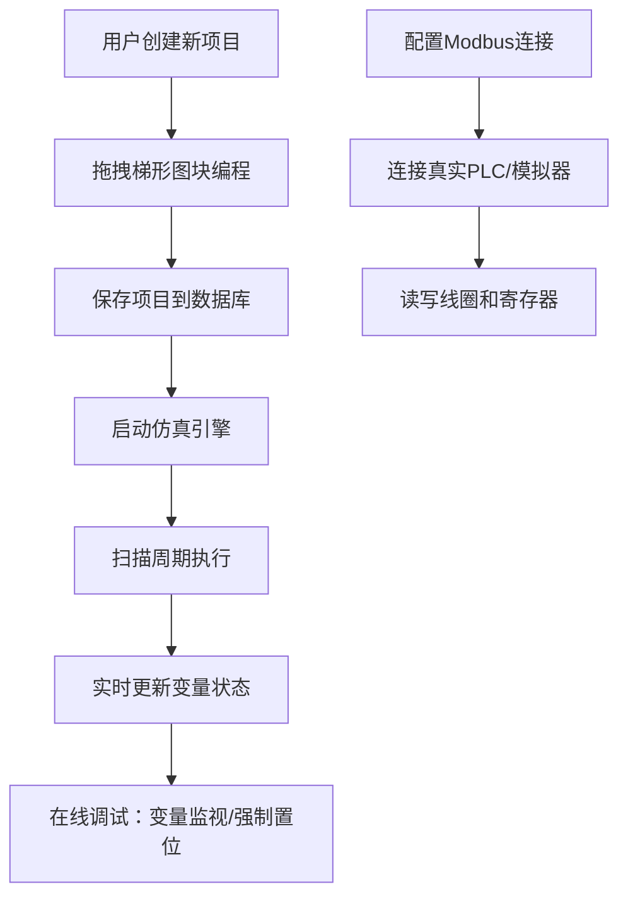

# PLC梯形图仿真Web应用 - 产品需求文档

## 1. 产品概述
本项目是一个基于Web的PLC梯形图编程与仿真平台，支持用户通过可视化方式创建梯形图程序，通过后端Go引擎进行实时仿真执行，并支持在线调试和真实PLC通信。

- 主要用途：工业自动化教育、PLC程序开发调试、仿真验证
- 目标用户：自动化工程师、电气工程师、自动化专业学生
- 核心价值：降低PLC学习门槛、提供安全的仿真环境、支持真实设备通信

## 2. 核心功能

### 2.1 用户角色
本项目为单用户系统，无需登录认证

### 2.2 功能模块
1. **梯形图编辑器**：Blockly可视化编程界面，支持拖拽式创建梯形图
2. **仿真引擎**：Go后端实现PLC扫描周期执行逻辑
3. **在线调试器**：变量监视、强制置位/复位功能
4. **Modbus通信**：与真实PLC或模拟器通信
5. **项目管理**：数据库存储和管理项目文件

### 2.3 页面详情
| 页面名称 | 模块名称 | 功能描述 |
|-----------|-------------|---------------------|
| 主工作台 | 梯形图编辑器 | Blockly画布，自定义梯形图块（触点、线圈、定时器） |
| 主工作台 | 工具栏 | 新建/保存项目、运行/停止仿真、调试控制 |
| 主工作台 | 变量监视面板 | 实时显示所有变量状态、支持强制置位 |
| 主工作台 | Modbus配置面板 | 配置PLC连接参数、读写线圈和寄存器 |
| 项目管理 | 项目列表 | 显示保存的项目、支持加载和删除 |

## 3. 核心流程

## 4. 用户界面设计

### 4.1 设计风格
- **主色调**：工业蓝 (#1e3a5f)、科技绿 (#10b981)
- **按钮风格**：圆角矩形，悬停阴影效果
- **字体**：JetBrains Mono（代码）、Noto Sans（界面）
- **布局风格**：三栏式布局（左侧工具区、中间编辑器、右侧监控区）
- **图标风格**：Lucide工业风图标，线条简洁

### 4.2 页面设计概述
| 页面名称 | 模块名称 | UI元素 |
|-----------|-------------|-------------|
| 主工作台 | 梯形图编辑器 | Blockly画布、拖拽块、连接线、网格背景 |
| 主工作台 | 变量监视面板 | 数据表格、实时刷新动画、状态指示灯 |
| 主工作台 | Modbus配置面板 | 表单输入、连接状态指示、数据读写按钮 |
| 项目管理 | 项目列表 | 卡片式布局、项目缩略图、操作按钮 |

### 4.3 响应性
- Desktop-first设计，支持平板适配
- 移动端简化布局自动调整为上下布局
- 触摸操作优化

## 5. 梯形图组件规格

### 5.1 基本元件类型
- **触点**：常开触点、常闭触点、上升沿触点、下降沿触点
- **线圈**：普通线圈、置位线圈、复位线圈
- **定时器**：TON（延时接通、TOF延时断开、TP脉冲定时器

### 5.2 变量系统
- **输入变量(I)**：离散输入
- **输出变量(Q)**：离散输出
- **内部变量(M)**：中间继电器
- **定时器变量(T)**：定时器状态和当前值
