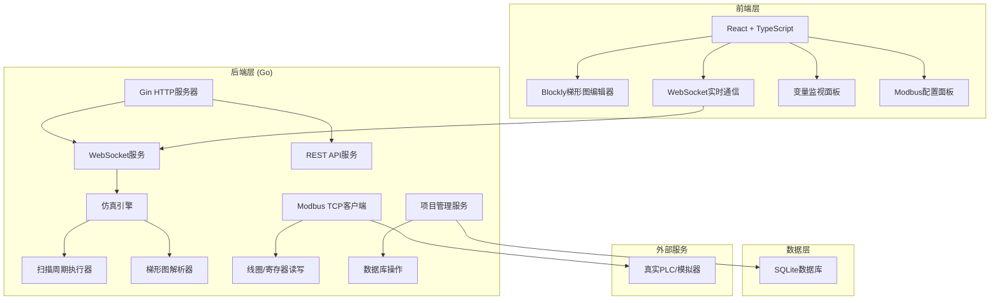
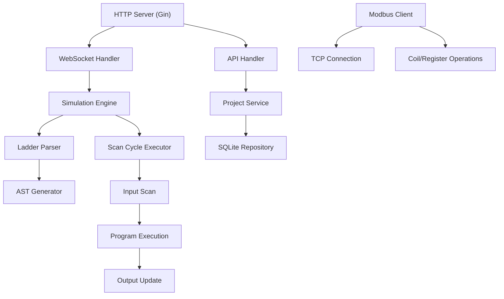
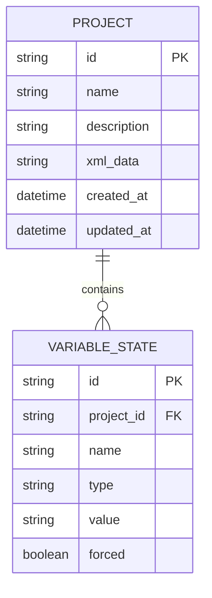

# PLC梯形图仿真Web应用 - 技术架构文档

## 1. 架构设计



## 2. 技术栈说明

- **前端**: React@18 + TypeScript + Vite + TailwindCSS@3 + Blockly + Zustand
- **后端**: Go 1.21 + Gin + WebSocket + Modbus TCP库
- **数据库**: SQLite (便于本地部署)
- **通信**: WebSocket (实时数据) + REST API (项目管理)

## 3. 目录结构

```
p149/
├── frontend/              # 前端React项目
│   ├── src/
│   │   ├── components/    # React组件
│   │   │   ├── Editor/    # Blockly编辑器
│   │   │   ├── Monitor/   # 变量监视
│   │   │   └── Modbus/    # Modbus面板
│   │   ├── blocks/        # Blockly自定义块
│   │   ├── store/         # Zustand状态管理
│   │   ├── utils/         # 工具函数
│   │   └── pages/         # 页面
│   └── package.json
├── backend/               # 后端Go项目
│   ├── cmd/
│   │   └── server/        # 主程序入口
│   ├── internal/
│   │   ├── engine/        # 仿真引擎
│   │   ├── parser/        # 梯形图解析器
│   │   ├── modbus/        # Modbus客户端
│   │   ├── api/           # API处理
│   │   └── models/        # 数据模型
│   ├── pkg/
│   └── go.mod
└── data/                  # SQLite数据库文件
```

## 4. 前端路由定义

| Route | 页面 | 功能 |
|-------|------|------|
| / | 主工作台 | 梯形图编辑 + 仿真控制 + 变量监视 |
| /projects | 项目管理 | 项目列表、加载/删除项目 |
| /modbus | Modbus配置 | PLC连接配置、数据读写测试 |

## 5. API定义

### 5.1 REST API

```typescript
// 项目相关
interface Project {
  id: string;
  name: string;
  description: string;
  xmlData: string;      // Blockly XML数据
  createdAt: Date;
  updatedAt: Date;
}

GET /api/projects          // 获取项目列表
GET /api/projects/:id      // 获取单个项目
POST /api/projects         // 创建新项目
PUT /api/projects/:id      // 更新项目
DELETE /api/projects/:id   // 删除项目

// Modbus相关
interface ModbusConfig {
  host: string;
  port: number;
  slaveId: number;
}

POST /api/modbus/connect
POST /api/modbus/disconnect
POST /api/modbus/read-coils
POST /api/modbus/write-coil
POST /api/modbus/read-registers
POST /api/modbus/write-register
```

### 5.2 WebSocket消息

```typescript
// 客户端 -> 服务端
type ClientMessage = 
  | { type: 'start_simulation'; xml: string }
  | { type: 'stop_simulation' }
  | { type: 'force_set'; variable: string; value: boolean }
  | { type: 'force_reset'; variable: string }
  | { type: 'release_force'; variable: string };

// 服务端 -> 客户端
type ServerMessage =
  | { type: 'simulation_started' }
  | { type: 'simulation_stopped' }
  | { type: 'scan_complete'; cycle: number; variables: VariableState[] }
  | { type: 'variable_updated'; variable: string; value: any };

interface VariableState {
  name: string;
  type: 'I' | 'Q' | 'M' | 'T';
  value: boolean | number;
  forced?: boolean;
}
```

## 6. 后端服务架构



## 7. 数据模型

### 7.1 ER图



### 7.2 DDL语句

```sql
CREATE TABLE projects (
    id TEXT PRIMARY KEY,
    name TEXT NOT NULL,
    description TEXT,
    xml_data TEXT NOT NULL,
    created_at DATETIME DEFAULT CURRENT_TIMESTAMP,
    updated_at DATETIME DEFAULT CURRENT_TIMESTAMP
);

CREATE INDEX idx_projects_name ON projects(name);
```

## 8. 梯形图块定义

### 8.1 触点块
- 常开触点 (NO)
- 常闭触点 (NC)
- 上升沿触点 (POS)
- 下降沿触点 (NEG)

### 8.2 线圈块
- 普通线圈 (OUT)
- 置位线圈 (SET)
- 复位线圈 (RST)

### 8.3 定时器块
- TON: 延时接通
- TOF: 延时断开
- TP: 脉冲定时器
