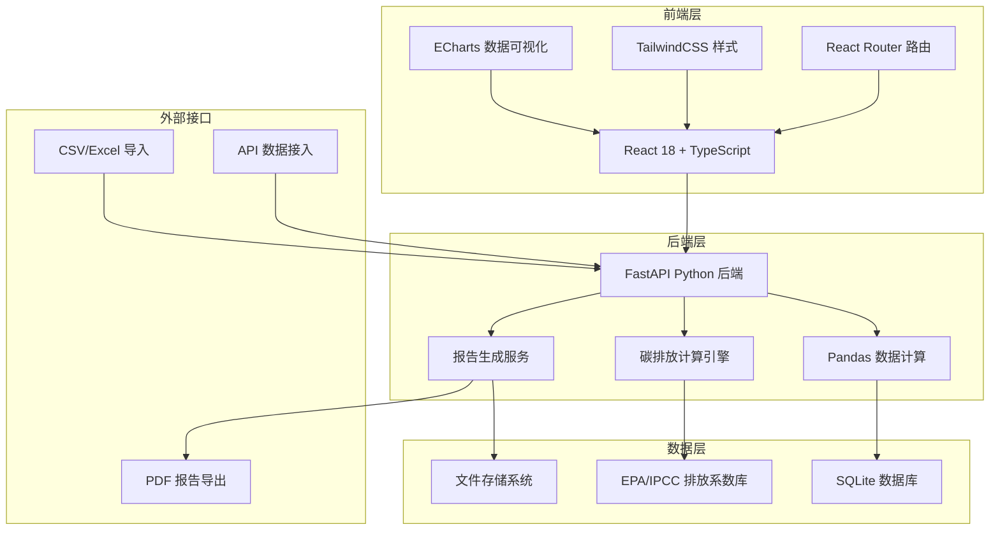
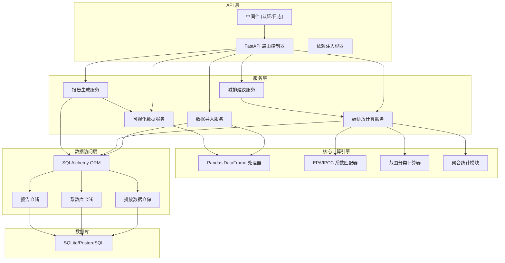
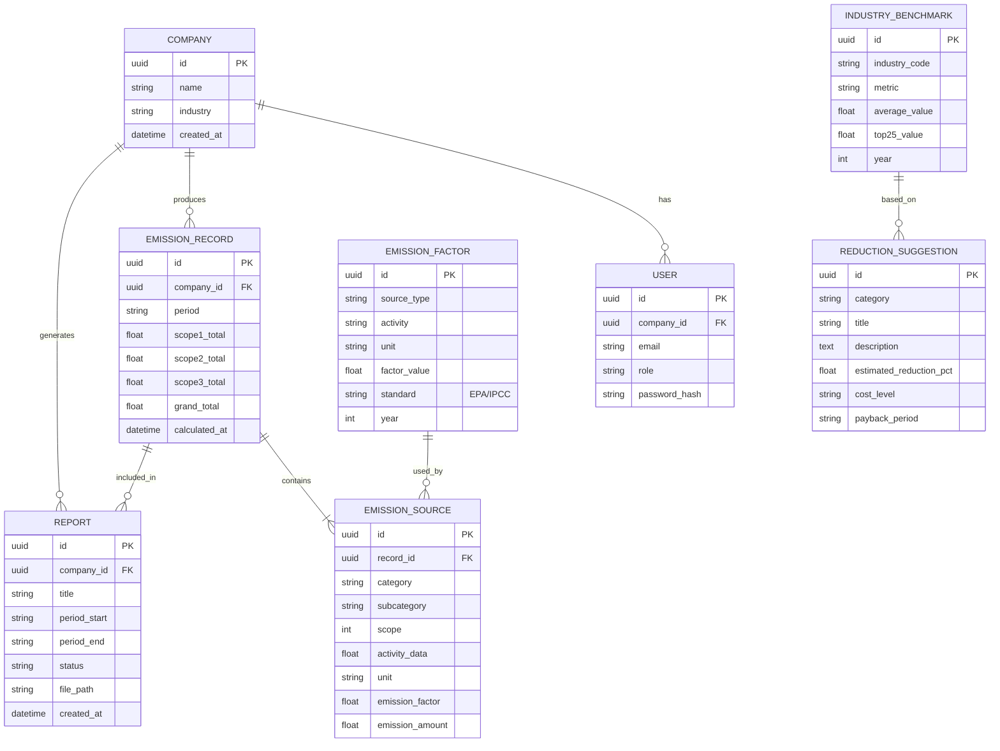

# 供应链碳排放管理系统 - 技术架构文档

## 1. 架构设计



## 2. 技术描述

- **前端**：React@18 + TypeScript + Vite + TailwindCSS@3 + ECharts
- **后端**：FastAPI@0.104 + Python@3.11 + Pandas@2.1
- **数据库**：SQLite (开发环境) / PostgreSQL (生产环境)
- **图表库**：ECharts@5.4 (支持丰富的图表类型和交互)
- **报告生成**：ReportLab + Matplotlib (PDF导出)
- **文件处理**：Pandas + openpyxl (Excel处理)

### 核心计算架构
- **pandas聚合计算**：用于大规模数据的快速聚合、分组、统计分析
- **EPA/IPCC系数匹配**：基于活动数据类型自动匹配对应排放因子
- **范围一二三分类计算**：按GHG Protocol标准分范围计算排放量

## 3. 路由定义

| 路由 | 页面名称 | 说明 |
|------|----------|------|
| /login | 登录页 | 用户认证入口 |
| /dashboard | 仪表盘 | 核心数据可视化展示 |
| /data-import | 数据导入 | 文件上传与API配置 |
| /reduction | 减排建议 | 基准对比与措施推荐 |
| /reports | 报告中心 | 报告生成与下载 |
| /history | 历史数据 | 历史记录查询与对比 |

## 4. API 定义

### 4.1 TypeScript 类型定义

```typescript
// 排放数据类型
interface EmissionData {
  id: string;
  period: string;
  scope1: number;
  scope2: number;
  scope3: number;
  total: number;
  breakdown: EmissionSource[];
}

interface EmissionSource {
  category: string;
  subcategory: string;
  scope: number;
  amount: number;
  unit: string;
  emissionFactor: number;
  emission: number;
}

// 减排建议类型
interface ReductionSuggestion {
  id: string;
  title: string;
  description: string;
  category: string;
  priority: 'high' | 'medium' | 'low';
  estimatedReduction: number;
  estimatedCost: string;
  paybackPeriod: string;
  industryBenchmark: number;
}

// 报告类型
interface Report {
  id: string;
  title: string;
  createdAt: string;
  period: { start: string; end: string };
  status: 'generating' | 'completed' | 'failed';
  downloadUrl?: string;
}
```

### 4.2 API 接口定义

| 方法 | 路径 | 说明 | 请求体 | 响应体 |
|------|------|------|--------|--------|
| POST | /api/auth/login | 用户登录 | {email, password} | {token, user} |
| GET | /api/emissions/summary | 获取排放汇总 | period | EmissionData |
| GET | /api/emissions/trend | 获取趋势数据 | months | {dates, values}[] |
| GET | /api/emissions/breakdown | 获取排放构成 | scope | EmissionSource[] |
| POST | /api/data/upload | 上传数据文件 | FormData | {fileId, preview} |
| POST | /api/data/process | 处理数据计算 | {fileId, config} | {resultId} |
| GET | /api/reduction/suggestions | 获取减排建议 | industry | ReductionSuggestion[] |
| GET | /api/reduction/benchmark | 获取行业基准 | industry | {benchmarks} |
| POST | /api/reports/generate | 生成报告 | {period, charts} | {reportId} |
| GET | /api/reports/:id/download | 下载报告 | - | PDF文件 |

## 5. 服务器架构图



## 6. 数据模型

### 6.1 数据模型 ER 图



### 6.2 数据定义语言 (DDL)

```sql
-- 企业表
CREATE TABLE companies (
    id UUID PRIMARY KEY DEFAULT gen_random_uuid(),
    name VARCHAR(255) NOT NULL,
    industry VARCHAR(100),
    created_at TIMESTAMP DEFAULT CURRENT_TIMESTAMP
);

-- 用户表
CREATE TABLE users (
    id UUID PRIMARY KEY DEFAULT gen_random_uuid(),
    company_id UUID REFERENCES companies(id),
    email VARCHAR(255) UNIQUE NOT NULL,
    role VARCHAR(50) NOT NULL DEFAULT 'user',
    password_hash VARCHAR(255) NOT NULL,
    created_at TIMESTAMP DEFAULT CURRENT_TIMESTAMP
);

-- 排放系数表 (预置EPA/IPCC标准系数)
CREATE TABLE emission_factors (
    id UUID PRIMARY KEY DEFAULT gen_random_uuid(),
    source_type VARCHAR(100) NOT NULL,
    activity VARCHAR(255) NOT NULL,
    unit VARCHAR(50) NOT NULL,
    factor_value DECIMAL(12, 6) NOT NULL,
    standard VARCHAR(50) NOT NULL,
    year INT NOT NULL,
    UNIQUE(source_type, activity, standard, year)
);

-- 排放记录表
CREATE TABLE emission_records (
    id UUID PRIMARY KEY DEFAULT gen_random_uuid(),
    company_id UUID REFERENCES companies(id),
    period VARCHAR(20) NOT NULL,
    scope1_total DECIMAL(18, 6) DEFAULT 0,
    scope2_total DECIMAL(18, 6) DEFAULT 0,
    scope3_total DECIMAL(18, 6) DEFAULT 0,
    grand_total DECIMAL(18, 6) DEFAULT 0,
    calculated_at TIMESTAMP DEFAULT CURRENT_TIMESTAMP,
    UNIQUE(company_id, period)
);

-- 排放源明细表
CREATE TABLE emission_sources (
    id UUID PRIMARY KEY DEFAULT gen_random_uuid(),
    record_id UUID REFERENCES emission_records(id) ON DELETE CASCADE,
    category VARCHAR(100) NOT NULL,
    subcategory VARCHAR(255),
    scope INT NOT NULL CHECK (scope IN (1, 2, 3)),
    activity_data DECIMAL(18, 6) NOT NULL,
    unit VARCHAR(50) NOT NULL,
    emission_factor DECIMAL(12, 6) NOT NULL,
    emission_amount DECIMAL(18, 6) NOT NULL
);

-- 行业基准表
CREATE TABLE industry_benchmarks (
    id UUID PRIMARY KEY DEFAULT gen_random_uuid(),
    industry_code VARCHAR(50) NOT NULL,
    metric VARCHAR(100) NOT NULL,
    average_value DECIMAL(18, 6) NOT NULL,
    top25_value DECIMAL(18, 6) NOT NULL,
    year INT NOT NULL,
    UNIQUE(industry_code, metric, year)
);

-- 减排建议表
CREATE TABLE reduction_suggestions (
    id UUID PRIMARY KEY DEFAULT gen_random_uuid(),
    category VARCHAR(100) NOT NULL,
    title VARCHAR(255) NOT NULL,
    description TEXT,
    estimated_reduction_pct DECIMAL(5, 2) NOT NULL,
    cost_level VARCHAR(50) NOT NULL,
    payback_period VARCHAR(50),
    applicable_industries TEXT[]
);

-- 报告表
CREATE TABLE reports (
    id UUID PRIMARY KEY DEFAULT gen_random_uuid(),
    company_id UUID REFERENCES companies(id),
    title VARCHAR(255) NOT NULL,
    period_start VARCHAR(20) NOT NULL,
    period_end VARCHAR(20) NOT NULL,
    status VARCHAR(50) NOT NULL DEFAULT 'generating',
    file_path VARCHAR(500),
    created_at TIMESTAMP DEFAULT CURRENT_TIMESTAMP
);

-- 创建索引
CREATE INDEX idx_emission_records_company ON emission_records(company_id);
CREATE INDEX idx_emission_sources_record ON emission_sources(record_id);
CREATE INDEX idx_emission_sources_scope ON emission_sources(scope);
```
