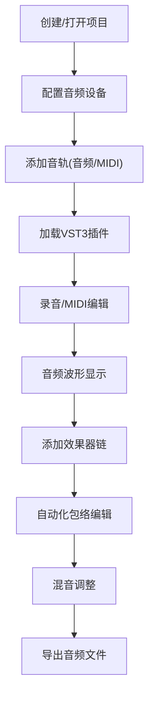

## 1. 产品概述

桌面数字音频工作站(DAW)是一款专业的音频制作软件，支持VST3插件加载、多轨录音混音、MIDI编辑和音频波形可视化。目标用户为音乐制作人、音频工程师和音乐爱好者。

产品核心价值：提供跨平台、高性能的音频制作环境，结合Rust的实时音频处理能力和Electron的现代UI体验。

## 2. 核心功能

### 2.1 用户角色
| 角色 | 登录方式 | 核心权限 |
|------|---------|---------|
| 音乐制作人 | 本地应用 | 创建项目、录音、混音、插件管理 |
| 音频工程师 | 本地应用 | 高级混音、自动化控制、导出设置 |

### 2.2 功能模块
1. **主工作区**：多轨时间轴、混音台、插件管理
2. **音轨编辑**：音频波形显示、MIDI编辑器、剪辑操作
3. **插件系统**：VST3扫描、乐器加载、效果器链
4. **录音控制**：输入选择、电平监测、录音启停
5. **自动化系统**：包络线编辑、参数自动化
6. **导出功能**：多格式音频导出、渲染设置

### 2.3 页面详情
| 页面名称 | 模块名称 | 功能描述 |
|---------|---------|---------|
| 主工作区 | 时间轴 | 多轨波形显示、拖拽剪辑、缩放导航 |
| 主工作区 | 混音台 | 音量推子、声像旋钮、效果器插入点 |
| 插件浏览器 | 扫描模块 | VST3插件扫描、分类管理、收藏功能 |
| MIDI编辑器 | 钢琴卷帘 | 音符编辑、力度控制、量化功能 |
| 自动化面板 | 包络线 | 参数节点编辑、曲线调整、包络可视化 |

## 3. 核心流程

## 4. 用户界面设计

### 4.1 设计风格
- **主色调**：深灰背景(#1a1a2e) + 霓虹青强调(#00f5d4) + 橙红警告(#ff6b6b)
- **辅助色**：轨道彩色标识(蓝、绿、紫、黄)
- **按钮风格**：极简工业风，细微边框，点击反馈动画
- **字体**：主字体 - JetBrains Mono(等宽专业感)；标题 - Orbitron(科技感)
- **布局风格**：模块化面板布局，可拖拽停靠，多窗口支持
- **图标风格**：线性简约图标，霓虹发光效果

### 4.2 页面设计概览
| 页面名称 | 模块名称 | UI元素 |
|---------|---------|--------|
| 主工作区 | 时间轴 | 深色背景、波形渐变、网格线、拖拽句柄、缩放滑块 |
| 主工作区 | 混音台 | 垂直推子、圆形旋钮、VU表动画、电平峰值保持 |
| 插件浏览器 | 列表 | 卡片式布局、插件图标、分类标签、搜索框 |
| MIDI编辑器 | 钢琴卷帘 | 网格背景、音符块、力度柱状图、量化按钮 |

### 4.3 响应式
- 桌面端优先设计，支持多显示器
- 面板可自由拖拽组合
- 高DPI屏幕适配
- 触控屏支持(推子、旋钮操作)

### 4.4 动效设计
- VU表实时动画，发光效果
- 波形平滑滚动
- 推子旋钮阻尼感动画
- 面板切换过渡动效
- 录音状态脉冲闪烁
