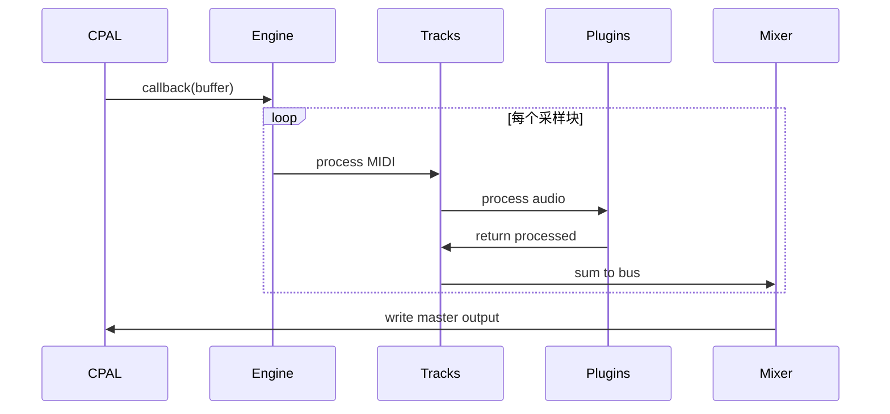

## 1. 架构设计

```mermaid
graph TB
    subgraph "Electron 主进程"
        A[Electron Main]
        B[Neon Bindings]
        C[插件扫描模块]
    end
    
    subgraph "Rust 音频引擎"
        D[CPAL 音频渲染]
        E[VST3 主机]
        F[MIDI 处理]
        G[混音引擎]
        H[音频IO]
    end
    
    subgraph "渲染进程 UI"
        I[React@18]
        J[Redux Toolkit]
        K[Canvas 波形]
        L[WebAudio 预览]
        M[组件库]
    end
    
    subgraph "数据层"
        N[项目文件 JSON]
        O[音频缓存]
        P[插件数据库]
    end
    
    A --> B
    B --> D
    B --> E
    C --> P
    D --> G
    E --> G
    F --> E
    H --> D
    I --> A
    J --> I
    K --> I
    N --> I
    O --> K
```

## 2. 技术栈说明

### 2.1 核心技术栈
| 层级 | 技术选型 | 版本 | 用途 |
|------|---------|------|------|
| 桌面框架 | Electron | ^28.0 | 跨平台桌面应用 |
| 前端框架 | React | ^18.2 | UI 渲染 |
| 状态管理 | Redux Toolkit | ^2.0 | 全局状态管理 |
| 构建工具 | Vite | ^5.0 | 快速构建与HMR |
| 样式方案 | TailwindCSS | ^3.4 | 原子化CSS |
| 音频引擎 | Rust + CPAL | - | 实时音频渲染 |
| VST3绑定 | vst3-sys | - | VST3插件加载 |
| 原生绑定 | Neon | - | Rust-Node.js 桥接 |
| 语言 | TypeScript | ^5.3 | 类型安全 |

### 2.2 项目结构
```
p25-daw/
├── src/
│   ├── main/                 # Electron 主进程
│   │   ├── index.ts
│   │   ├── audio-bridge.ts   # Neon 绑定调用
│   │   └── plugin-scanner.ts # VST3 插件扫描
│   ├── renderer/             # React 渲染进程
│   │   ├── App.tsx
│   │   ├── store/            # Redux
│   │   ├── components/
│   │   │   ├── timeline/     # 时间轴
│   │   │   ├── mixer/        # 混音台
│   │   │   ├── plugins/      # 插件浏览器
│   │   │   └── midi/         # MIDI编辑器
│   │   └── utils/
│   └── native/               # Rust 原生模块
│       ├── audio-engine/     # CPAL 音频引擎
│       ├── vst3-host/        # VST3 主机实现
│       └── neon-bindings/    # Neon FFI 绑定
├── package.json
├── Cargo.toml
└── vite.config.ts
```

## 3. 核心模块定义

### 3.1 TypeScript 类型定义

```typescript
// 音轨类型
interface Track {
  id: string;
  name: string;
  type: 'audio' | 'midi' | 'instrument';
  volume: number;
  pan: number;
  muted: boolean;
  solo: boolean;
  color: string;
  clips: Clip[];
  plugins: PluginInstance[];
  automation: AutomationTrack[];
}

// 音频剪辑
interface Clip {
  id: string;
  trackId: string;
  startTime: number;
  endTime: number;
  filePath?: string;
  waveformData?: number[];
  midiNotes?: MidiNote[];
}

// MIDI 音符
interface MidiNote {
  noteNumber: number;
  velocity: number;
  startTime: number;
  duration: number;
}

// VST3 插件
interface PluginInfo {
  id: string;
  name: string;
  vendor: string;
  category: 'instrument' | 'effect';
  path: string;
}

// 音频引擎状态
interface AudioEngineState {
  isPlaying: boolean;
  isRecording: boolean;
  bpm: number;
  sampleRate: number;
  bufferSize: number;
  playheadPosition: number;
}
```

### 3.2 Redux State 结构

```typescript
interface RootState {
  project: {
    name: string;
    filePath: string;
    sampleRate: number;
  };
  transport: AudioEngineState;
  tracks: Track[];
  plugins: {
    available: PluginInfo[];
    scanned: boolean;
  };
  ui: {
    activePanel: string;
    zoomLevel: number;
    scrollPosition: number;
  };
}
```

## 4. Rust 音频引擎架构

### 4.1 核心结构体

```rust
// audio-engine/src/engine.rs
pub struct AudioEngine {
    sample_rate: u32,
    buffer_size: u32,
    tracks: Vec<Track>,
    master_mixer: MasterMixer,
    playhead: Arc<AtomicU64>,
    is_playing: Arc<AtomicBool>,
}

// vst3-host/src/host.rs
pub struct Vst3Host {
    plugin_paths: Vec<PathBuf>,
    loaded_plugins: HashMap<String, PluginInstance>,
}

// midi/src/processor.rs
pub struct MidiProcessor {
    event_buffer: Vec<MidiEvent>,
    active_notes: HashMap<u8, ActiveNote>,
}
```

### 4.2 音频处理流程



## 5. IPC 通信协议

### 5.1 主进程 → 渲染进程

```typescript
// 音频引擎状态更新
type EngineStateUpdate = {
  type: 'ENGINE_STATE_UPDATE';
  payload: AudioEngineState;
};

// 峰值电平更新
type LevelUpdate = {
  type: 'LEVEL_UPDATE';
  payload: { trackId: string; left: number; right: number };
};

// 波形数据
type WaveformData = {
  type: 'WAVEFORM_DATA';
  payload: { clipId: string; data: number[] };
};
```

### 5.2 渲染进程 → 主进程

```typescript
// 传输控制
type TransportCommand = {
  action: 'PLAY' | 'STOP' | 'RECORD' | 'SEEK';
  position?: number;
};

// 插件操作
type PluginCommand = {
  action: 'LOAD' | 'UNLOAD' | 'SCAN';
  pluginId?: string;
  trackId?: string;
};
```
