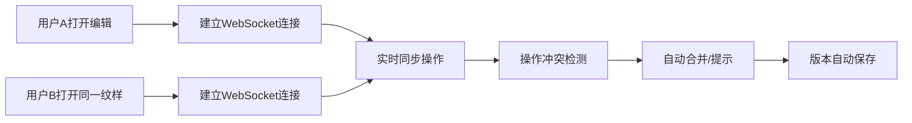

# 民族传统服饰纹样数字化平台 - 产品需求文档

## 1. 产品概述

民族传统服饰纹样数字化平台是一个专注于小众民族服饰纹样采集、编辑和智能生成的全栈应用。解决民族纹样数字化保存难、传承效率低的问题，为非遗保护、服装设计、文化研究提供专业工具。

- 核心价值：实现民族传统服饰纹样的数字化采集、智能提取、创新生成与协同管理
- 目标用户：非遗保护工作者、民族服饰设计师、文化研究学者、手工艺传承人

## 2. 核心功能

### 2.1 用户角色

| 角色 | 注册方式 | 核心权限 |
|------|----------|----------|
| 采集员 | 管理员邀请 | 纹样拍照上传、基础编辑、个人素材管理 |
| 设计师 | 自主注册/邀请 | 纹样编辑、特征调整、图案生成、协同编辑 |
| 管理员 | 系统分配 | 用户管理、权限分配、全库素材审核、数据统计 |

### 2.2 功能模块

1. **纹样采集操作台**：相机拍照上传、图片导入、质量评估、原始素材管理
2. **纹样编辑页**：手动勾勒提取、边缘检测、区域选择、图层管理
3. **图案生成预览页**：特征参数调整、智能组合算法、实时预览、批量生成
4. **用户管理页**：用户列表、权限设置、操作日志、团队管理

### 2.3 页面详情

| 页面名称 | 模块名称 | 功能描述 |
|----------|----------|----------|
| 纹样采集操作台 | 相机控件 | 调用设备相机、拍照、多图连拍、图像预览 |
| 纹样采集操作台 | 上传管理 | 图片拖拽上传、格式校验、进度显示、批量导入 |
| 纹样采集操作台 | 素材库 | 原始纹样列表、分类筛选、标签管理、详情查看 |
| 纹样编辑页 | 勾勒工具 | 钢笔工具、魔棒选择、边缘增强、路径平滑 |
| 纹样编辑页 | 特征提取 | 自动轮廓识别、颜色提取、纹理分析、参数量化 |
| 纹样编辑页 | 图层编辑 | 图层管理、透明度调整、混合模式、历史撤销 |
| 纹样编辑页 | 协同同步 | 实时多人编辑、光标显示、操作同步、冲突解决 |
| 图案生成预览页 | 参数调整 | 纹样大小、旋转角度、排列密度、颜色方案 |
| 图案生成预览页 | 智能生成 | AI组合算法、风格迁移、图案平铺、变体生成 |
| 图案生成预览页 | 预览导出 | 实时渲染预览、高清导出、格式选择、水印添加 |
| 用户管理页 | 用户管理 | 用户列表、角色分配、状态管理、批量操作 |
| 用户管理页 | 权限配置 | 模块权限、操作权限、团队权限、临时授权 |
| 用户管理页 | 操作日志 | 用户行为记录、操作回溯、异常监控、数据导出 |

## 3. 核心流程

### 3.1 纹样采集与编辑流程

### 3.2 多人协同编辑流程

## 4. 用户界面设计

### 4.1 设计风格

**色彩系统：**
- 主色调：深靛蓝 #1E3A5F - 体现传统文化的庄重与专业
- 辅助色：土金色 #B8860B - 呼应民族服饰的华贵质感
- 强调色：朱砂红 #C41E3A - 传统中国红，用于操作按钮
- 中性色：墨灰 #2C2C2C、宣纸白 #F5F0E6 - 模拟传统纸张质感

**按钮样式：**
- 圆角设计 (4px-8px)，轻微浮雕效果
- 主按钮采用朱砂红渐变，悬停时有光泽动画
- 操作按钮配民族纹样边框装饰

**字体选择：**
- 标题：Noto Serif SC - 宋体风格，体现文化底蕴
- 正文：Noto Sans SC - 清晰易读
- 字号层级：12px/14px/16px/20px/28px/36px

**布局风格：**
- 左侧工具栏 + 中央画布 + 右侧属性面板的经典工作台布局
- 水墨边框装饰元素
- 卡片采用宣纸纹理背景
- 图标融入传统纹样元素

### 4.2 页面设计概览

| 页面名称 | 模块名称 | UI 元素 |
|----------|----------|---------|
| 采集操作台 | 整体布局 | 三栏布局：左侧分类、中间采集区、右侧素材列表 |
| 纹样编辑页 | 画布区域 | 大尺寸编辑画布、网格背景、标尺辅助 |
| 纹样编辑页 | 工具栏 | 左侧垂直图标工具栏、工具选中态高亮 |
| 图案生成页 | 参数面板 | 滑动条、数值输入、颜色选择器、实时预览 |
| 用户管理页 | 数据表格 | 分页表格、筛选器、操作列、状态标签 |

### 4.3 响应式设计

- 桌面端优先：针对专业工作台优化，支持 1920px+ 宽屏
- 平板适配：工具栏转为可折叠面板，画布自适应
- 移动端：仅支持素材浏览和基础管理，编辑功能限制使用

### 4.4 交互动效

- 页面加载：纹样水印渐显加载动画
- 工具切换：图标旋转+颜色过渡
- 画布操作：选取框虚线流动动画
- 协同编辑：多色光标跟随与操作提示气泡
- 生成过程：纹样粒子组合动画效果
