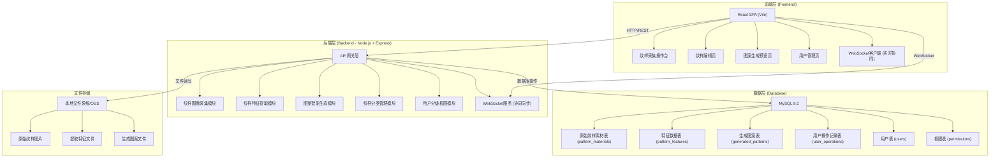
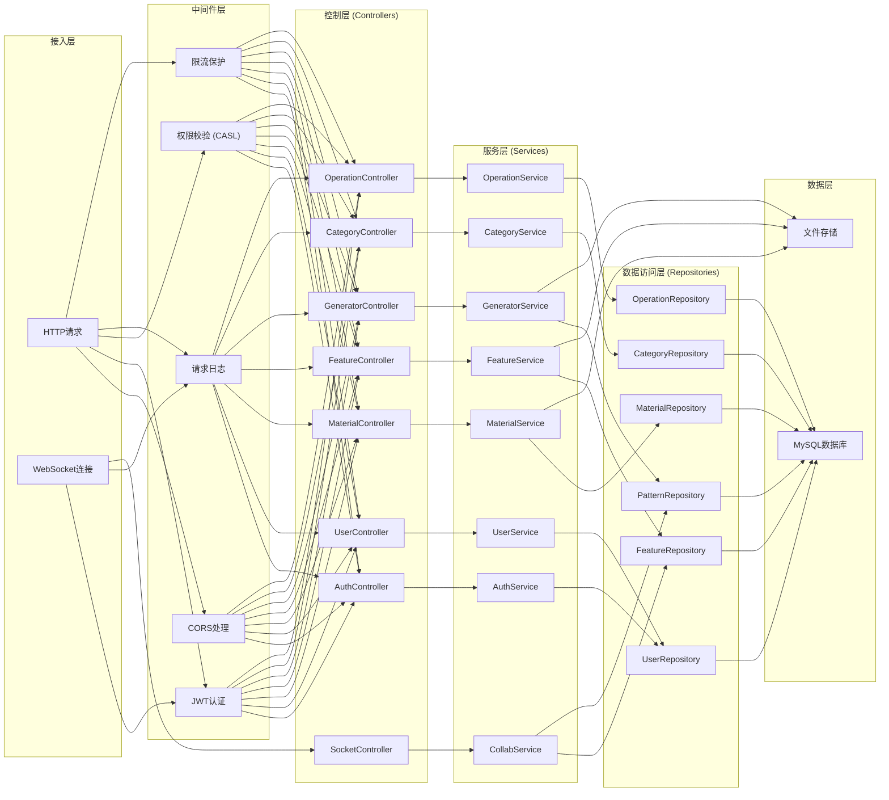
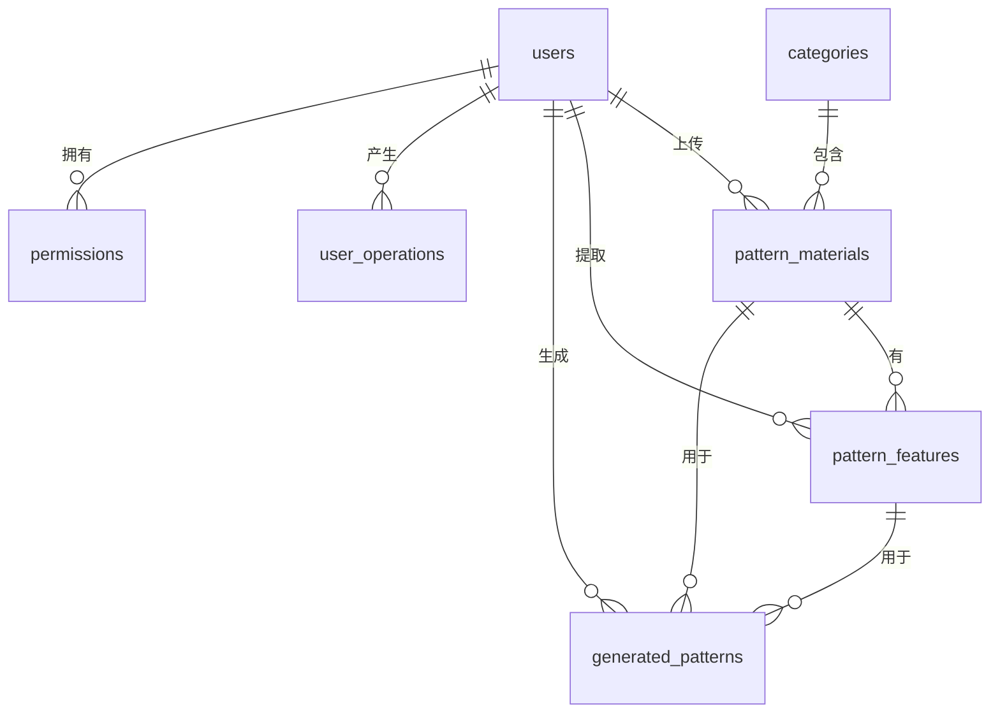

# 民族传统服饰纹样数字化平台 - 技术架构文档

## 1. 架构设计



## 2. 技术栈说明

### 2.1 前端技术栈
- **核心框架**: React 18 + TypeScript
- **构建工具**: Vite 5
- **样式方案**: Tailwind CSS 3 + PostCSS
- **路由管理**: React Router v6
- **状态管理**: Zustand (轻量级状态管理)
- **图像处理**: Fabric.js (画布编辑) + OpenCV.js (特征提取)
- **实时通信**: Socket.io Client
- **HTTP客户端**: Axios
- **UI组件**: 自定义组件 + Headless UI
- **图标方案**: Lucide React + 自定义传统纹样图标

### 2.2 后端技术栈
- **核心框架**: Node.js + Express 4
- **语言**: TypeScript
- **数据库**: MySQL 8.0 + mysql2
- **ORM**: Prisma
- **实时通信**: Socket.io
- **文件上传**: Multer
- **图像处理**: Sharp + node-opencv
- **身份认证**: JWT + bcrypt
- **权限控制**: CASL (能力-based权限控制)
- **日志管理**: Winston
- **API文档**: Swagger UI + OpenAPI

### 2.3 开发与部署
- **代码规范**: ESLint + Prettier
- **Git Hooks**: Husky + lint-staged
- **环境管理**: dotenv
- **进程管理**: PM2 (生产环境)
- **反向代理**: Nginx

## 3. 路由定义

### 3.1 前端路由

| 路由路径 | 页面名称 | 说明 |
|----------|----------|------|
| / | 首页/仪表盘 | 项目概览与快捷入口 |
| /capture | 纹样采集操作台 | 相机拍照、图片上传 |
| /editor/:id | 纹样编辑页 | 纹样勾勒、特征提取 |
| /generator | 图案生成预览页 | 参数调整、智能生成 |
| /users | 用户管理页 | 用户列表、权限配置 |
| /login | 登录页 | 用户登录 |
| /materials | 素材库 | 纹样素材浏览管理 |

### 3.2 后端API路由

| 路由前缀 | 模块 | 说明 |
|----------|------|------|
| /api/auth | 用户权限模块 | 登录、注册、权限验证 |
| /api/users | 用户权限模块 | 用户CRUD、权限管理 |
| /api/materials | 纹样采集模块 | 纹样素材上传、查询、管理 |
| /api/features | 特征提取模块 | 特征提取、保存、查询 |
| /api/generator | 图案生成模块 | 图案生成、预览、导出 |
| /api/categories | 分类管理模块 | 纹样分类CRUD |
| /api/operations | 日志模块 | 操作记录查询 |

## 4. API 接口定义

### 4.1 TypeScript 类型定义

```typescript
// 用户相关
interface User {
  id: string;
  username: string;
  email: string;
  role: 'collector' | 'designer' | 'admin';
  avatar?: string;
  createdAt: Date;
  updatedAt: Date;
}

interface LoginRequest {
  email: string;
  password: string;
}

interface LoginResponse {
  token: string;
  user: User;
}

// 纹样素材
interface PatternMaterial {
  id: string;
  name: string;
  description?: string;
  categoryId?: string;
  ethnicity?: string;
  imageUrl: string;
  thumbnailUrl: string;
  status: 'pending' | 'processed' | 'error';
  uploadedBy: string;
  createdAt: Date;
  updatedAt: Date;
}

interface UploadMaterialRequest {
  name: string;
  description?: string;
  categoryId?: string;
  ethnicity?: string;
  file: File;
}

// 纹样特征
interface PatternFeature {
  id: string;
  materialId: string;
  contourData: string;
  colorPalette: string[];
  textureFeatures: Record<string, number>;
  geometricParams: {
    aspectRatio: number;
    complexity: number;
    symmetry: number;
  };
  extractedBy: string;
  createdAt: Date;
}

interface ExtractFeatureRequest {
  materialId: string;
  manualContour?: number[][];
}

// 生成图案
interface GeneratedPattern {
  id: string;
  name: string;
  baseFeatures: string[];
  parameters: {
    scale: number;
    rotation: number;
    density: number;
    colorScheme: string[];
  };
  previewUrl: string;
  highResUrl?: string;
  createdBy: string;
  createdAt: Date;
}

interface GeneratePatternRequest {
  featureIds: string[];
  parameters: {
    scale: number;
    rotation: number;
    density: number;
    colorScheme: string[];
  };
}

// 操作日志
interface UserOperation {
  id: string;
  userId: string;
  action: string;
  resourceType: string;
  resourceId?: string;
  details?: Record<string, any>;
  ip?: string;
  createdAt: Date;
}

// WebSocket 消息
interface CollaborativeMessage {
  type: 'cursor' | 'draw' | 'edit' | 'save';
  userId: string;
  username: string;
  patternId: string;
  payload: any;
  timestamp: number;
}
```

### 4.2 API 响应格式

```typescript
interface ApiResponse<T> {
  success: boolean;
  data?: T;
  error?: {
    code: string;
    message: string;
    details?: any;
  };
  pagination?: {
    page: number;
    pageSize: number;
    total: number;
    totalPages: number;
  };
}
```

## 5. 后端服务架构



## 6. 数据模型

### 6.1 ER 图



### 6.2 数据库表定义 (DDL)

```sql
-- 用户表
CREATE TABLE users (
  id VARCHAR(36) PRIMARY KEY,
  username VARCHAR(50) NOT NULL UNIQUE,
  email VARCHAR(100) NOT NULL UNIQUE,
  password_hash VARCHAR(255) NOT NULL,
  role ENUM('collector', 'designer', 'admin') NOT NULL DEFAULT 'collector',
  avatar VARCHAR(255),
  status ENUM('active', 'inactive', 'banned') NOT NULL DEFAULT 'active',
  last_login_at DATETIME,
  created_at DATETIME NOT NULL DEFAULT CURRENT_TIMESTAMP,
  updated_at DATETIME NOT NULL DEFAULT CURRENT_TIMESTAMP ON UPDATE CURRENT_TIMESTAMP,
  INDEX idx_email (email),
  INDEX idx_role (role)
) ENGINE=InnoDB DEFAULT CHARSET=utf8mb4 COLLATE=utf8mb4_unicode_ci;

-- 权限表
CREATE TABLE permissions (
  id VARCHAR(36) PRIMARY KEY,
  user_id VARCHAR(36) NOT NULL,
  module VARCHAR(50) NOT NULL,
  can_create BOOLEAN NOT NULL DEFAULT FALSE,
  can_read BOOLEAN NOT NULL DEFAULT TRUE,
  can_update BOOLEAN NOT NULL DEFAULT FALSE,
  can_delete BOOLEAN NOT NULL DEFAULT FALSE,
  created_at DATETIME NOT NULL DEFAULT CURRENT_TIMESTAMP,
  updated_at DATETIME NOT NULL DEFAULT CURRENT_TIMESTAMP ON UPDATE CURRENT_TIMESTAMP,
  UNIQUE KEY uk_user_module (user_id, module),
  FOREIGN KEY (user_id) REFERENCES users(id) ON DELETE CASCADE
) ENGINE=InnoDB DEFAULT CHARSET=utf8mb4 COLLATE=utf8mb4_unicode_ci;

-- 纹样分类表
CREATE TABLE categories (
  id VARCHAR(36) PRIMARY KEY,
  name VARCHAR(100) NOT NULL,
  parent_id VARCHAR(36),
  ethnicity VARCHAR(100),
  description TEXT,
  sort_order INT NOT NULL DEFAULT 0,
  created_at DATETIME NOT NULL DEFAULT CURRENT_TIMESTAMP,
  updated_at DATETIME NOT NULL DEFAULT CURRENT_TIMESTAMP ON UPDATE CURRENT_TIMESTAMP,
  FOREIGN KEY (parent_id) REFERENCES categories(id) ON DELETE SET NULL
) ENGINE=InnoDB DEFAULT CHARSET=utf8mb4 COLLATE=utf8mb4_unicode_ci;

-- 原始纹样素材表
CREATE TABLE pattern_materials (
  id VARCHAR(36) PRIMARY KEY,
  name VARCHAR(200) NOT NULL,
  description TEXT,
  category_id VARCHAR(36),
  ethnicity VARCHAR(100),
  image_url VARCHAR(255) NOT NULL,
  thumbnail_url VARCHAR(255) NOT NULL,
  image_width INT,
  image_height INT,
  file_size BIGINT,
  status ENUM('pending', 'processing', 'processed', 'error') NOT NULL DEFAULT 'pending',
  error_message TEXT,
  uploaded_by VARCHAR(36) NOT NULL,
  created_at DATETIME NOT NULL DEFAULT CURRENT_TIMESTAMP,
  updated_at DATETIME NOT NULL DEFAULT CURRENT_TIMESTAMP ON UPDATE CURRENT_TIMESTAMP,
  INDEX idx_status (status),
  INDEX idx_category (category_id),
  INDEX idx_uploaded_by (uploaded_by),
  INDEX idx_ethnicity (ethnicity),
  FOREIGN KEY (category_id) REFERENCES categories(id) ON DELETE SET NULL,
  FOREIGN KEY (uploaded_by) REFERENCES users(id)
) ENGINE=InnoDB DEFAULT CHARSET=utf8mb4 COLLATE=utf8mb4_unicode_ci;

-- 纹样特征数据表
CREATE TABLE pattern_features (
  id VARCHAR(36) PRIMARY KEY,
  material_id VARCHAR(36) NOT NULL,
  contour_data LONGTEXT NOT NULL,
  color_palette JSON NOT NULL,
  texture_features JSON NOT NULL,
  geometric_params JSON NOT NULL,
  is_manual BOOLEAN NOT NULL DEFAULT FALSE,
  extracted_by VARCHAR(36) NOT NULL,
  created_at DATETIME NOT NULL DEFAULT CURRENT_TIMESTAMP,
  updated_at DATETIME NOT NULL DEFAULT CURRENT_TIMESTAMP ON UPDATE CURRENT_TIMESTAMP,
  UNIQUE KEY uk_material (material_id),
  INDEX idx_extracted_by (extracted_by),
  FOREIGN KEY (material_id) REFERENCES pattern_materials(id) ON DELETE CASCADE,
  FOREIGN KEY (extracted_by) REFERENCES users(id)
) ENGINE=InnoDB DEFAULT CHARSET=utf8mb4 COLLATE=utf8mb4_unicode_ci;

-- 生成的图案表
CREATE TABLE generated_patterns (
  id VARCHAR(36) PRIMARY KEY,
  name VARCHAR(200) NOT NULL,
  base_feature_ids JSON NOT NULL,
  parameters JSON NOT NULL,
  preview_url VARCHAR(255) NOT NULL,
  high_res_url VARCHAR(255),
  is_public BOOLEAN NOT NULL DEFAULT FALSE,
  created_by VARCHAR(36) NOT NULL,
  created_at DATETIME NOT NULL DEFAULT CURRENT_TIMESTAMP,
  updated_at DATETIME NOT NULL DEFAULT CURRENT_TIMESTAMP ON UPDATE CURRENT_TIMESTAMP,
  INDEX idx_created_by (created_by),
  INDEX idx_created_at (created_at),
  FOREIGN KEY (created_by) REFERENCES users(id)
) ENGINE=InnoDB DEFAULT CHARSET=utf8mb4 COLLATE=utf8mb4_unicode_ci;

-- 用户操作记录表
CREATE TABLE user_operations (
  id VARCHAR(36) PRIMARY KEY,
  user_id VARCHAR(36) NOT NULL,
  action VARCHAR(100) NOT NULL,
  resource_type VARCHAR(50) NOT NULL,
  resource_id VARCHAR(36),
  details JSON,
  ip_address VARCHAR(45),
  user_agent TEXT,
  created_at DATETIME NOT NULL DEFAULT CURRENT_TIMESTAMP,
  INDEX idx_user_id (user_id),
  INDEX idx_action (action),
  INDEX idx_created_at (created_at),
  FOREIGN KEY (user_id) REFERENCES users(id)
) ENGINE=InnoDB DEFAULT CHARSET=utf8mb4 COLLATE=utf8mb4_unicode_ci;

-- 协同编辑会话表
CREATE TABLE collaborative_sessions (
  id VARCHAR(36) PRIMARY KEY,
  pattern_id VARCHAR(36) NOT NULL,
  active_users JSON NOT NULL,
  last_activity DATETIME NOT NULL,
  created_at DATETIME NOT NULL DEFAULT CURRENT_TIMESTAMP,
  INDEX idx_pattern (pattern_id),
  INDEX idx_last_activity (last_activity)
) ENGINE=InnoDB DEFAULT CHARSET=utf8mb4 COLLATE=utf8mb4_unicode_ci;
```

### 6.3 初始数据

```sql
-- 插入默认分类
INSERT INTO categories (id, name, ethnicity, sort_order) VALUES
('cat_001', '云纹', '通用', 1),
('cat_002', '水纹', '通用', 2),
('cat_003', '花卉纹', '通用', 3),
('cat_004', '动物纹', '通用', 4),
('cat_005', '几何纹', '通用', 5),
('cat_006', '蜡染纹', '苗族', 6),
('cat_007', '刺绣纹', '彝族', 7),
('cat_008', '织锦纹', '壮族', 8);

-- 插入管理员用户 (密码: admin123)
INSERT INTO users (id, username, email, password_hash, role, status) VALUES
('user_admin', 'admin', 'admin@pattern.com', '$2b$10$hash_of_admin123', 'admin', 'active');
```

## 7. 项目目录结构

### 7.1 整体结构

```
p34/
├── frontend/                 # 前端项目
├── backend/                  # 后端项目
├── .trae/                    # Trae 配置
│   └── documents/            # 项目文档
└── README.md                 # 项目说明
```

### 7.2 前端目录结构

```
frontend/
├── public/
│   └── favicon.ico
├── src/
│   ├── assets/               # 静态资源
│   │   ├── images/
│   │   ├── icons/
│   │   └── fonts/
│   ├── components/           # 公共组件
│   │   ├── layout/
│   │   ├── ui/
│   │   └── patterns/
│   ├── pages/                # 页面组件
│   │   ├── Capture/
│   │   ├── Editor/
│   │   ├── Generator/
│   │   ├── Users/
│   │   ├── Materials/
│   │   └── Login/
│   ├── hooks/                # 自定义 Hooks
│   ├── store/                # 状态管理
│   ├── services/             # API 服务
│   ├── types/                # TypeScript 类型
│   ├── utils/                # 工具函数
│   ├── styles/               # 全局样式
│   ├── App.tsx
│   ├── main.tsx
│   └── vite-env.d.ts
├── index.html
├── package.json
├── tsconfig.json
├── vite.config.ts
├── tailwind.config.js
└── postcss.config.js
```

### 7.3 后端目录结构

```
backend/
├── src/
│   ├── controllers/          # 控制器层
│   ├── services/             # 服务层
│   ├── repositories/         # 数据访问层
│   ├── middleware/           # 中间件
│   ├── routes/               # 路由定义
│   ├── types/                # 类型定义
│   ├── utils/                # 工具函数
│   ├── config/               # 配置文件
│   ├── prisma/               # Prisma Schema
│   │   └── schema.prisma
│   ├── sockets/              # WebSocket 处理
│   └── app.ts                # 应用入口
├── uploads/                  # 文件上传目录
│   ├── materials/
│   ├── features/
│   └── generated/
├── logs/                     # 日志目录
├── package.json
├── tsconfig.json
└── .env
```
