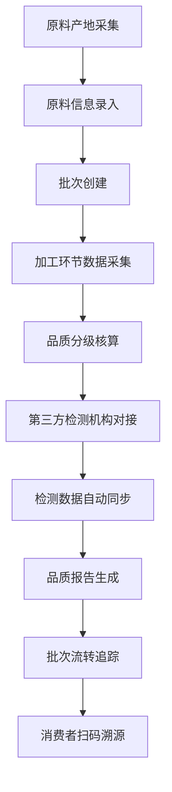

# 传统手工艺品原料溯源系统 - 产品需求文档

## 1. 产品概述
传统手工艺品原料溯源分布式 API 服务，实现原料从产地、加工到检测的全链路追溯，对接第三方检测机构自动同步数据，支持跨系统安全调用，数据库分库存储保障数据安全与扩展。

- **核心目标**: 解决传统手工艺品原料来源不透明、品质无法追溯的行业痛点
- **目标用户**: 手工艺品生产企业、原料供应商、第三方检测机构、监管部门、终端消费者
- **市场价值**: 提升手工艺品行业公信力，建立品质保障体系，助力非遗文化传承与数字化转型

## 2. 核心功能

### 2.1 用户角色
| 角色 | 注册方式 | 核心权限 |
|------|----------|----------|
| 企业管理员 | 企业认证注册 | 原料录入、批次管理、溯源查询、权限分配 |
| 质检人员 | 管理员分配 | 品质分级、检测数据录入、报告生成 |
| 检测机构 | 官方认证接入 | 检测数据同步、报告上传、接口对接 |
| 监管人员 | 政府授权 | 全链路查询、数据审计、异常预警 |
| 消费者 | 扫码查询 | 原料溯源查询、品质信息查看 |

### 2.2 功能模块
1. **原料信息管理**: 原料基础信息录入、产地信息管理、供应商档案维护
2. **溯源数据采集**: 加工环节数据采集、物流信息追踪、全链路数据关联
3. **品质分级核算**: 品质标准配置、自动分级算法、品质报告生成
4. **批次管理**: 批次创建、批次流转追踪、批次库存管理
5. **第三方检测对接**: 检测机构接入、数据自动同步、检测报告管理
6. **权限鉴权**: 用户认证、角色权限、API 密钥管理、接口访问控制

### 2.3 接口详情
| 接口模块 | 接口名称 | 功能描述 |
|----------|----------|----------|
| 原料信息 | 原料录入接口 | 录入原料基础信息、产地、供应商等数据 |
| 原料信息 | 原料查询接口 | 支持多条件查询原料信息 |
| 溯源数据 | 数据采集接口 | 采集各环节溯源数据（加工、物流等） |
| 溯源数据 | 全链路查询接口 | 查询原料完整追溯链条 |
| 品质分级 | 品质核算接口 | 根据标准自动计算品质等级 |
| 品质分级 | 报告生成接口 | 生成品质检测报告 |
| 批次管理 | 批次创建接口 | 创建新的原料批次 |
| 批次管理 | 批次流转接口 | 记录批次流转状态 |
| 检测机构 | 数据同步接口 | 对接第三方检测机构自动同步数据 |
| 检测机构 | 报告上传接口 | 上传检测机构出具的正式报告 |
| 权限鉴权 | 用户登录接口 | 用户认证与 Token 发放 |
| 权限鉴权 | 权限验证接口 | 接口调用权限校验 |

## 3. 核心流程

### 3.1 原料全链路溯源流程

### 3.2 跨系统数据同步流程
1. 第三方检测机构通过鉴权接口获取访问令牌
2. 使用合法令牌调用数据同步接口上传检测数据
3. 系统验证数据完整性后进行分库存储
4. 自动关联对应原料批次并更新品质状态
5. 触发通知机制告知相关企业用户

## 4. 系统架构设计

### 4.1 技术选型
- **后端框架**: Node.js + Express.js / NestJS
- **数据库**: PostgreSQL（分库存储）
- **认证方式**: JWT + API Key 双重认证
- **数据传输**: RESTful API + JSON
- **部署方式**: Docker 容器化 + 微服务架构

### 4.2 分库设计
| 数据库 | 存储内容 | 独立部署 |
|--------|----------|----------|
| 原料信息库 | 原料基础数据、供应商信息、产地信息 | 是 |
| 溯源记录库 | 各环节溯源数据、加工记录、物流信息 | 是 |
| 品质数据库 | 品质标准、分级结果、检测报告 | 是 |

### 4.3 安全设计
- HTTPS 全链路加密传输
- API 签名验证防止篡改
- 请求频率限制防止滥用
- 敏感数据脱敏存储
- 操作日志全面审计

### 4.4 扩展性设计
- 微服务架构支持独立部署
- 数据库读写分离优化性能
- 消息队列异步处理高并发
- 缓存层加速热点数据访问
