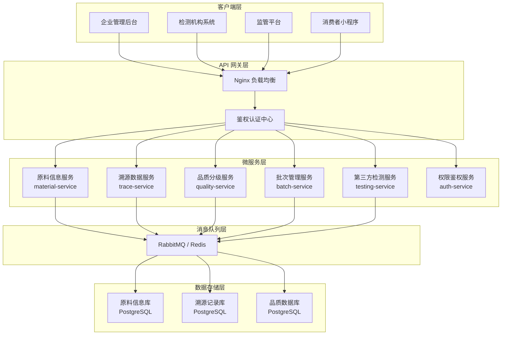
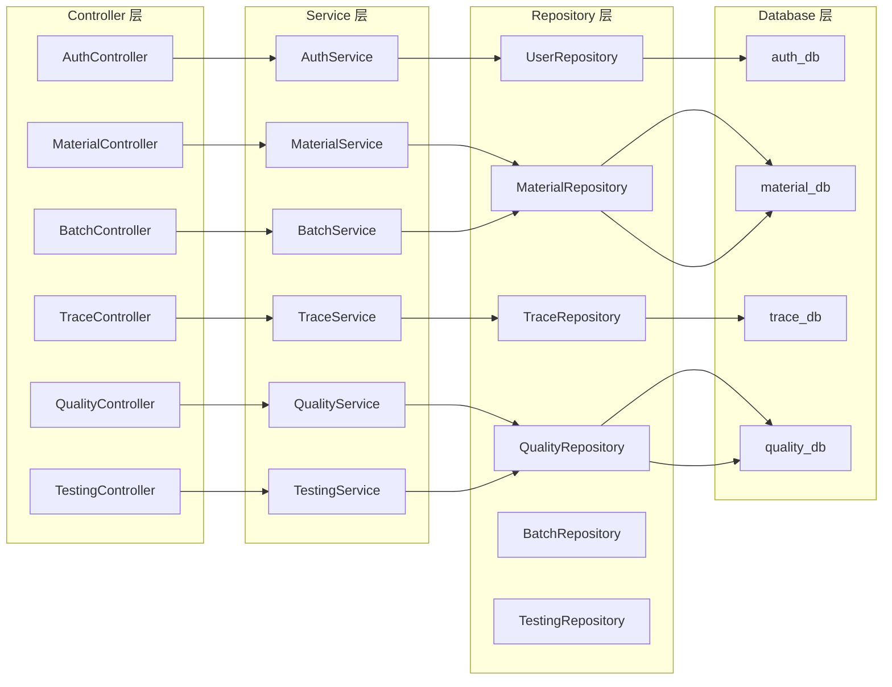
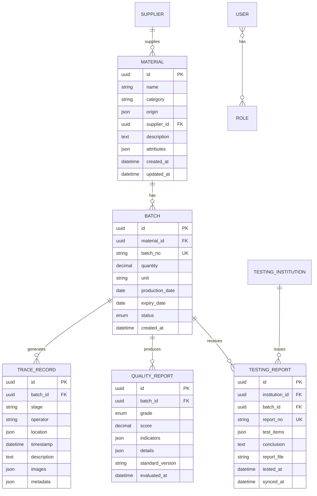

# 传统手工艺品原料溯源系统 - 技术架构文档

## 1. 整体架构设计



## 2. 技术栈选型

| 层级 | 技术选型 | 版本 | 说明 |
|------|----------|------|------|
| 运行环境 | Node.js | 18.x LTS | 服务端运行环境 |
| 后端框架 | Express.js | 4.18.x | 轻量级 Web 框架 |
| 数据库 | PostgreSQL | 15.x | 关系型数据库，支持分库 |
| ORM 框架 | Sequelize | 6.x | 数据库 ORM 工具 |
| 认证方案 | JWT + bcrypt | 9.x / 5.x | Token 认证与密码加密 |
| API 文档 | Swagger / OpenAPI | 5.x | 自动生成 API 文档 |
| 日志框架 | Winston | 3.x | 日志管理 |
| 配置管理 | dotenv | 16.x | 环境变量管理 |
| 代码规范 | ESLint + Prettier | 8.x / 2.x | 代码质量保障 |
| 测试框架 | Jest + Supertest | 29.x | 单元测试与接口测试 |
| 容器化 | Docker + Docker Compose | 最新 | 容器部署 |

## 3. 项目目录结构

```
p79/
├── .trae/
│   └── documents/
│       ├── 产品需求文档.md
│       └── 技术架构文档.md
├── services/
│   ├── auth-service/
│   │   ├── src/
│   │   │   ├── controllers/
│   │   │   ├── models/
│   │   │   ├── routes/
│   │   │   ├── middleware/
│   │   │   └── index.js
│   │   ├── package.json
│   │   └── Dockerfile
│   ├── material-service/
│   │   ├── src/
│   │   ├── package.json
│   │   └── Dockerfile
│   ├── trace-service/
│   ├── quality-service/
│   ├── batch-service/
│   └── testing-service/
├── gateway/
│   ├── nginx.conf
│   └── docker-compose.yml
├── database/
│   ├── migrations/
│   ├── seeds/
│   └── init.sql
├── shared/
│   ├── utils/
│   ├── constants/
│   └── types/
├── docker-compose.yml
└── README.md
```

## 4. API 接口定义

### 4.1 权限鉴权接口

```typescript
// 用户登录
POST /api/auth/login
Request:
{
  "username": "string",
  "password": "string"
}
Response:
{
  "code": 200,
  "message": "success",
  "data": {
    "token": "string",
    "expiresIn": 7200,
    "user": {
      "id": "string",
      "username": "string",
      "role": "string"
    }
  }
}

// 权限验证中间件
// Headers: Authorization: Bearer {token}
```

### 4.2 原料信息录入接口

```typescript
// 原料信息录入
POST /api/materials
Request:
{
  "name": "string",
  "category": "string",
  "origin": {
    "province": "string",
    "city": "string",
    "address": "string"
  },
  "supplierId": "string",
  "description": "string",
  "attributes": {
    "color": "string",
    "texture": "string",
    "weight": "number"
  }
}
Response:
{
  "code": 201,
  "message": "原料信息录入成功",
  "data": {
    "materialId": "string",
    "createdAt": "datetime"
  }
}

// 原料信息查询
GET /api/materials/:id
GET /api/materials?category=&origin=&page=1&size=20
```

### 4.3 溯源数据采集接口

```typescript
// 溯源数据采集
POST /api/trace/records
Request:
{
  "batchId": "string",
  "stage": "string",
  "operator": "string",
  "location": {
    "latitude": "number",
    "longitude": "number",
    "address": "string"
  },
  "timestamp": "datetime",
  "description": "string",
  "images": ["string"],
  "metadata": {}
}
Response:
{
  "code": 201,
  "message": "溯源数据采集成功",
  "data": {
    "recordId": "string"
  }
}

// 全链路溯源查询
GET /api/trace/full/:batchId
```

### 4.4 品质分级核算接口

```typescript
// 品质分级核算
POST /api/quality/evaluate
Request:
{
  "batchId": "string",
  "indicators": {
    "purity": "number",
    "colorGrade": "string",
    "textureScore": "number",
    "moistureContent": "number"
  },
  "standardVersion": "string"
}
Response:
{
  "code": 200,
  "message": "品质分级完成",
  "data": {
    "batchId": "string",
    "qualityGrade": "A | B | C | D",
    "score": "number",
    "details": {},
    "evaluatedAt": "datetime"
  }
}

// 品质报告生成
GET /api/quality/report/:batchId
```

### 4.5 原料批次管理接口

```typescript
// 创建批次
POST /api/batches
Request:
{
  "materialId": "string",
  "batchNo": "string",
  "quantity": "number",
  "unit": "string",
  "productionDate": "date",
  "expiryDate": "date"
}
Response:
{
  "code": 201,
  "data": {
    "batchId": "string",
    "batchNo": "string"
  }
}

// 批次流转记录
PUT /api/batches/:id/status
```

### 4.6 第三方检测机构对接接口

```typescript
// 检测数据同步接口
POST /api/testing/sync
Headers:
  X-API-Key: {检测机构密钥}
Request:
{
  "institutionId": "string",
  "reportNo": "string",
  "batchId": "string",
  "testItems": [
    {
      "name": "string",
      "result": "string",
      "unit": "string",
      "standard": "string",
      "conclusion": "pass | fail"
    }
  ],
  "conclusion": "string",
  "reportFile": "string (base64)",
  "testedAt": "datetime"
}
Response:
{
  "code": 200,
  "message": "检测数据同步成功",
  "data": {
    "syncId": "string",
    "syncedAt": "datetime"
  }
}

// 检测机构注册
POST /api/testing/institutions/register
```

## 5. 服务架构图



## 6. 数据模型设计

### 6.1 ER 图



### 6.2 DDL 语句

```sql
-- 原料信息库 (material_db)
CREATE DATABASE material_db;
\c material_db;

CREATE TABLE suppliers (
  id UUID PRIMARY KEY DEFAULT gen_random_uuid(),
  name VARCHAR(255) NOT NULL,
  contact_person VARCHAR(100),
  phone VARCHAR(20),
  address TEXT,
  certification JSONB,
  created_at TIMESTAMP DEFAULT CURRENT_TIMESTAMP,
  updated_at TIMESTAMP DEFAULT CURRENT_TIMESTAMP
);

CREATE TABLE materials (
  id UUID PRIMARY KEY DEFAULT gen_random_uuid(),
  name VARCHAR(255) NOT NULL,
  category VARCHAR(100) NOT NULL,
  origin JSONB NOT NULL,
  supplier_id UUID REFERENCES suppliers(id),
  description TEXT,
  attributes JSONB,
  created_at TIMESTAMP DEFAULT CURRENT_TIMESTAMP,
  updated_at TIMESTAMP DEFAULT CURRENT_TIMESTAMP,
  INDEX idx_category (category),
  INDEX idx_supplier (supplier_id)
);

CREATE TABLE batches (
  id UUID PRIMARY KEY DEFAULT gen_random_uuid(),
  material_id UUID REFERENCES materials(id),
  batch_no VARCHAR(100) UNIQUE NOT NULL,
  quantity DECIMAL(10,2) NOT NULL,
  unit VARCHAR(20) NOT NULL,
  production_date DATE,
  expiry_date DATE,
  status VARCHAR(50) DEFAULT 'created',
  created_at TIMESTAMP DEFAULT CURRENT_TIMESTAMP,
  updated_at TIMESTAMP DEFAULT CURRENT_TIMESTAMP,
  INDEX idx_batch_no (batch_no),
  INDEX idx_material (material_id)
);

-- 溯源记录库 (trace_db)
CREATE DATABASE trace_db;
\c trace_db;

CREATE TABLE trace_records (
  id UUID PRIMARY KEY DEFAULT gen_random_uuid(),
  batch_id UUID NOT NULL,
  stage VARCHAR(100) NOT NULL,
  operator VARCHAR(100) NOT NULL,
  location JSONB,
  timestamp TIMESTAMP NOT NULL,
  description TEXT,
  images JSONB,
  metadata JSONB,
  created_at TIMESTAMP DEFAULT CURRENT_TIMESTAMP,
  INDEX idx_batch_id (batch_id),
  INDEX idx_stage (stage),
  INDEX idx_timestamp (timestamp)
);

-- 品质数据库 (quality_db)
CREATE DATABASE quality_db;
\c quality_db;

CREATE TABLE testing_institutions (
  id UUID PRIMARY KEY DEFAULT gen_random_uuid(),
  name VARCHAR(255) NOT NULL,
  api_key VARCHAR(255) UNIQUE NOT NULL,
  certification_no VARCHAR(100),
  contact_info JSONB,
  status VARCHAR(50) DEFAULT 'active',
  created_at TIMESTAMP DEFAULT CURRENT_TIMESTAMP
);

CREATE TABLE quality_reports (
  id UUID PRIMARY KEY DEFAULT gen_random_uuid(),
  batch_id UUID NOT NULL,
  grade VARCHAR(10) NOT NULL,
  score DECIMAL(5,2) NOT NULL,
  indicators JSONB NOT NULL,
  details JSONB,
  standard_version VARCHAR(50),
  evaluated_at TIMESTAMP DEFAULT CURRENT_TIMESTAMP,
  INDEX idx_batch_id (batch_id),
  INDEX idx_grade (grade)
);

CREATE TABLE testing_reports (
  id UUID PRIMARY KEY DEFAULT gen_random_uuid(),
  institution_id UUID REFERENCES testing_institutions(id),
  batch_id UUID NOT NULL,
  report_no VARCHAR(100) UNIQUE NOT NULL,
  test_items JSONB NOT NULL,
  conclusion TEXT,
  report_file TEXT,
  tested_at TIMESTAMP NOT NULL,
  synced_at TIMESTAMP DEFAULT CURRENT_TIMESTAMP,
  INDEX idx_batch_id (batch_id),
  INDEX idx_report_no (report_no)
);

-- 权限数据库 (auth_db)
CREATE DATABASE auth_db;
\c auth_db;

CREATE TABLE roles (
  id UUID PRIMARY KEY DEFAULT gen_random_uuid(),
  name VARCHAR(50) UNIQUE NOT NULL,
  permissions JSONB NOT NULL,
  description TEXT,
  created_at TIMESTAMP DEFAULT CURRENT_TIMESTAMP
);

CREATE TABLE users (
  id UUID PRIMARY KEY DEFAULT gen_random_uuid(),
  username VARCHAR(100) UNIQUE NOT NULL,
  password VARCHAR(255) NOT NULL,
  email VARCHAR(255),
  phone VARCHAR(20),
  role_id UUID REFERENCES roles(id),
  status VARCHAR(50) DEFAULT 'active',
  created_at TIMESTAMP DEFAULT CURRENT_TIMESTAMP,
  updated_at TIMESTAMP DEFAULT CURRENT_TIMESTAMP,
  INDEX idx_username (username)
);
```

## 7. 部署架构

### 7.1 Docker Compose 配置

```yaml
version: '3.8'
services:
  # 数据库服务
  postgres-material:
    image: postgres:15-alpine
    environment:
      POSTGRES_DB: material_db
      POSTGRES_USER: postgres
      POSTGRES_PASSWORD: postgres
    volumes:
      - postgres_material_data:/var/lib/postgresql/data

  postgres-trace:
    image: postgres:15-alpine
    environment:
      POSTGRES_DB: trace_db
      POSTGRES_USER: postgres
      POSTGRES_PASSWORD: postgres
    volumes:
      - postgres_trace_data:/var/lib/postgresql/data

  postgres-quality:
    image: postgres:15-alpine
    environment:
      POSTGRES_DB: quality_db
      POSTGRES_USER: postgres
      POSTGRES_PASSWORD: postgres
    volumes:
      - postgres_quality_data:/var/lib/postgresql/data

  postgres-auth:
    image: postgres:15-alpine
    environment:
      POSTGRES_DB: auth_db
      POSTGRES_USER: postgres
      POSTGRES_PASSWORD: postgres
    volumes:
      - postgres_auth_data:/var/lib/postgresql/data

  # 微服务
  auth-service:
    build: ./services/auth-service
    ports:
      - "3001:3000"
    environment:
      - DB_HOST=postgres-auth
      - DB_NAME=auth_db
    depends_on:
      - postgres-auth

  material-service:
    build: ./services/material-service
    ports:
      - "3002:3000"
    environment:
      - DB_HOST=postgres-material
      - DB_NAME=material_db
    depends_on:
      - postgres-material

  # 其他服务...

  # API 网关
  nginx-gateway:
    image: nginx:alpine
    ports:
      - "80:80"
    volumes:
      - ./gateway/nginx.conf:/etc/nginx/nginx.conf
    depends_on:
      - auth-service
      - material-service

volumes:
  postgres_material_data:
  postgres_trace_data:
  postgres_quality_data:
  postgres_auth_data:
```
