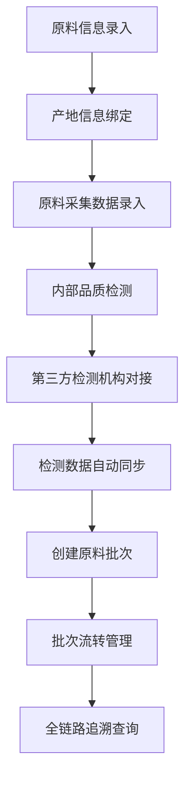

# 古法造纸原料溯源系统 - 产品需求文档

## 1. 产品概述
古法造纸原料全链路溯源系统，实现原料产地、采集、检测的完整数据追踪，对接第三方检测机构自动同步数据，支持跨系统调用，保障造纸原料品质可追溯。

- 核心目标：建立古法造纸原料从产地到成品的完整溯源链，确保品质可控、来源可查
- 目标用户：原料供应商、采集人员、品质检测人员、批次管理员、第三方检测机构

## 2. 核心功能

### 2.1 用户角色
| 角色 | 注册方式 | 核心权限 |
|------|----------|----------|
| 系统管理员 | 后台创建 | 全功能管理，用户权限配置 |
| 原料管理员 | 注册审批 | 原料信息录入、产地管理 |
| 采集人员 | 注册审批 | 采集数据录入、同步 |
| 质检人员 | 注册审批 | 品质检测数据管理 |
| 批次管理员 | 注册审批 | 批次创建、流转管理 |
| 第三方机构 | API对接 | 检测数据自动同步 |

### 2.2 功能模块
1. **原料信息管理**：原料档案录入、产地信息维护、原料分类管理
2. **采集数据管理**：采集记录录入、数据同步、采集批次跟踪
3. **品质检测管理**：自检数据录入、第三方检测数据对接、检测报告生成
4. **批次管理**：批次创建、批次流转、批次追溯查询
5. **第三方对接**：机构管理、数据同步、API鉴权
6. **系统管理**：用户管理、权限配置、日志审计

### 2.3 页面详情
| 页面名称 | 模块名称 | 功能描述 |
|-----------|-------------|---------------------|
| 登录页 | 权限鉴权 | 用户登录、Token获取、权限验证 |
| 仪表盘 | 数据概览 | 溯源统计图表、实时数据监控、异常告警 |
| 原料管理 | 原料信息 | 原料列表、新增/编辑原料、产地信息维护 |
| 采集管理 | 采集数据 | 采集记录列表、数据录入、批量同步 |
| 检测管理 | 品质检测 | 检测记录、第三方数据同步、报告查看 |
| 批次管理 | 批次追溯 | 批次创建、批次流转、全链路追溯查询 |
| 系统设置 | 权限管理 | 用户管理、角色配置、API密钥管理 |

## 3. 核心流程

### 3.1 原料溯源全流程
1. 原料管理员录入原料基础信息及产地信息
2. 采集人员在产地进行原料采集，录入采集数据
3. 原料进入质检环节，进行内部品质检测
4. 同步对接第三方检测机构，获取权威检测报告
5. 创建批次，进行原料流转管理
6. 通过批次号可追溯完整的产地-采集-检测全链路数据

## 4. 用户界面设计

### 4.1 设计风格
- **主色调**：深木色(#5D4037)，体现传统造纸工艺的文化底蕴
- **辅助色**：竹青色(#2E7D32)，代表自然环保
- **强调色**：金色(#FF8F00)，突出品质认证
- **按钮风格**：圆角矩形，渐变效果，微悬浮动画
- **字体**：标题使用宋体类衬线字体，正文使用无衬线字体
- **布局风格**：卡片式布局，左侧导航，顶部信息栏
- **图标风格**：线性图标，融入传统纹样元素

### 4.2 页面设计概览
| 页面名称 | 模块名称 | UI元素 |
|-----------|-------------|-------------|
| 仪表盘 | 数据概览 | 木纹背景、数据卡片、趋势图表、实时状态指示器 |
| 原料管理 | 列表详情 | 表格布局、筛选面板、详情抽屉、产地地图 |
| 追溯查询 | 时间线 | 垂直时间线、溯源节点、数据卡片、关联跳转 |

### 4.3 响应式
- 桌面端优先，支持1280px以上分辨率
- 平板端自适应，导航折叠为侧边菜单
- 移动端简化布局，优化表单输入体验
