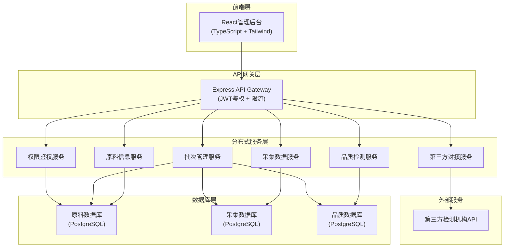
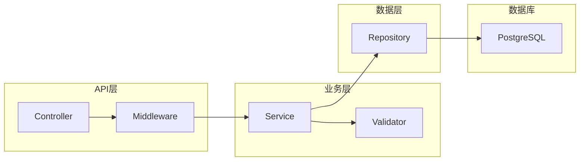
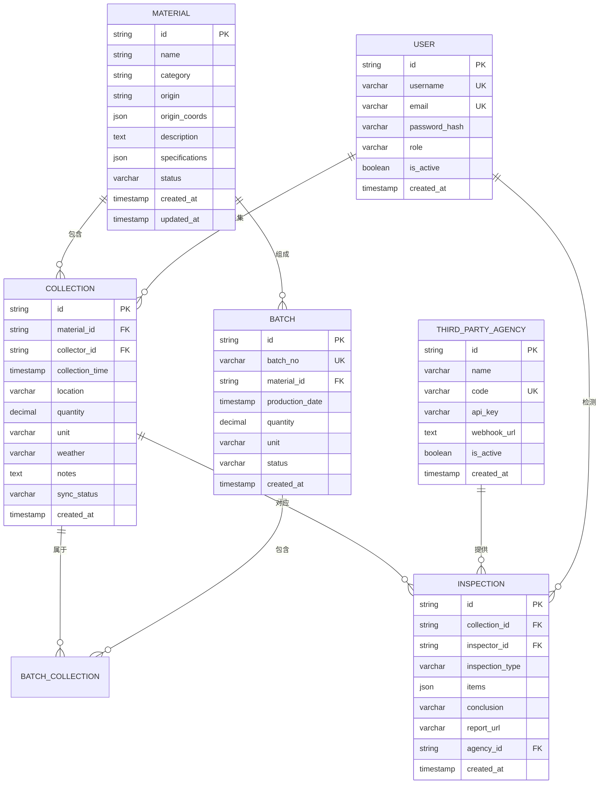

# 古法造纸原料溯源系统 - 技术架构文档

## 1. 架构设计



## 2. 技术描述

- **前端**: React@18 + TypeScript + TailwindCSS@3 + Vite + Zustand
- **后端**: Express@4 + TypeScript + JWT认证
- **数据库**: PostgreSQL (分库存储)
- **API文档**: Swagger/OpenAPI
- **跨系统调用**: RESTful API + Webhook
- **第三方对接**: 签名验证 + 异步回调

## 3. 路由定义

### 前端路由
| 路由 | 页面 | 用途 |
|------|------|------|
| /login | 登录页 | 用户登录、获取Token |
| /dashboard | 仪表盘 | 数据概览、统计图表 |
| /materials | 原料管理 | 原料列表、新增编辑 |
| /collection | 采集管理 | 采集记录、数据同步 |
| /inspection | 检测管理 | 品质检测、报告查看 |
| /batches | 批次管理 | 批次创建、追溯查询 |
| /settings | 系统设置 | 用户管理、权限配置 |

### API路由
| 路由前缀 | 服务 | 用途 |
|----------|------|------|
| /api/auth | 权限鉴权服务 | 登录、注册、Token刷新 |
| /api/materials | 原料信息服务 | 原料CRUD、产地管理 |
| /api/collection | 采集数据服务 | 采集记录、数据同步 |
| /api/inspection | 品质检测服务 | 检测记录、质检报告 |
| /api/batches | 批次管理服务 | 批次管理、追溯查询 |
| /api/third-party | 第三方对接服务 | 机构管理、数据同步 |

## 4. API定义

### 4.1 通用类型定义
```typescript
interface ApiResponse<T> {
  code: number;
  message: string;
  data: T;
  timestamp: number;
}

interface PaginationParams {
  page: number;
  pageSize: number;
}

interface PaginatedResponse<T> {
  list: T[];
  total: number;
  page: number;
  pageSize: number;
}
```

### 4.2 原料信息接口
```typescript
// 创建原料
interface CreateMaterialRequest {
  name: string;
  category: string;
  origin: string;
  originCoords?: { lat: number; lng: number };
  description?: string;
  specifications: Record<string, string>;
}

interface Material {
  id: string;
  name: string;
  category: string;
  origin: string;
  originCoords?: { lat: number; lng: number };
  description: string;
  specifications: Record<string, string>;
  status: 'active' | 'inactive';
  createdAt: string;
  updatedAt: string;
}
```

### 4.3 采集数据接口
```typescript
interface CreateCollectionRequest {
  materialId: string;
  collectorId: string;
  collectionTime: string;
  location: string;
  quantity: number;
  unit: string;
  weather?: string;
  notes?: string;
}

interface CollectionRecord {
  id: string;
  materialId: string;
  materialName: string;
  collectorId: string;
  collectorName: string;
  collectionTime: string;
  location: string;
  quantity: number;
  unit: string;
  weather: string;
  notes: string;
  syncStatus: 'pending' | 'synced' | 'failed';
  createdAt: string;
}
```

### 4.4 品质检测接口
```typescript
interface CreateInspectionRequest {
  collectionId: string;
  inspectorId: string;
  inspectionType: 'internal' | 'third_party';
  items: { name: string; value: string; standard?: string }[];
  conclusion: 'pass' | 'fail' | 'pending';
  reportUrl?: string;
}

interface InspectionRecord {
  id: string;
  collectionId: string;
  inspectorId: string;
  inspectorName: string;
  inspectionType: string;
  items: { name: string; value: string; standard: string }[];
  conclusion: string;
  reportUrl: string;
  thirdPartyAgency?: string;
  createdAt: string;
}
```

### 4.5 批次管理接口
```typescript
interface CreateBatchRequest {
  batchNo: string;
  materialId: string;
  collectionIds: string[];
  productionDate: string;
  quantity: number;
  unit: string;
}

interface Batch {
  id: string;
  batchNo: string;
  materialId: string;
  materialName: string;
  collectionIds: string[];
  productionDate: string;
  quantity: number;
  unit: string;
  status: 'producing' | 'completed' | 'shipped';
  traceChain: TraceNode[];
  createdAt: string;
}

interface TraceNode {
  type: 'material' | 'collection' | 'inspection' | 'batch';
  id: string;
  timestamp: string;
  operator: string;
  data: Record<string, any>;
}
```

### 4.6 第三方对接接口
```typescript
interface ThirdPartySyncRequest {
  agencyId: string;
  inspectionId: string;
  signature: string;
  timestamp: number;
}

interface ThirdPartyWebhookPayload {
  inspectionId: string;
  agencyCode: string;
  items: { name: string; value: string; standard: string }[];
  conclusion: string;
  reportUrl: string;
  signature: string;
  timestamp: number;
}
```

## 5. 服务架构



## 6. 数据模型

### 6.1 ER图



### 6.2 DDL语句

```sql
-- 原料信息库 (material_db)
CREATE DATABASE material_db;
\c material_db;

CREATE TABLE materials (
    id UUID PRIMARY KEY DEFAULT gen_random_uuid(),
    name VARCHAR(200) NOT NULL,
    category VARCHAR(100) NOT NULL,
    origin VARCHAR(200) NOT NULL,
    origin_coords JSONB,
    description TEXT,
    specifications JSONB,
    status VARCHAR(20) DEFAULT 'active',
    created_at TIMESTAMP DEFAULT CURRENT_TIMESTAMP,
    updated_at TIMESTAMP DEFAULT CURRENT_TIMESTAMP
);

CREATE INDEX idx_materials_category ON materials(category);
CREATE INDEX idx_materials_status ON materials(status);

-- 采集数据库 (collection_db)
CREATE DATABASE collection_db;
\c collection_db;

CREATE TABLE collections (
    id UUID PRIMARY KEY DEFAULT gen_random_uuid(),
    material_id UUID NOT NULL,
    collector_id UUID NOT NULL,
    collection_time TIMESTAMP NOT NULL,
    location VARCHAR(200) NOT NULL,
    quantity DECIMAL(10,2) NOT NULL,
    unit VARCHAR(20) NOT NULL,
    weather VARCHAR(100),
    notes TEXT,
    sync_status VARCHAR(20) DEFAULT 'pending',
    created_at TIMESTAMP DEFAULT CURRENT_TIMESTAMP
);

CREATE INDEX idx_collections_material_id ON collections(material_id);
CREATE INDEX idx_collections_collector_id ON collections(collector_id);
CREATE INDEX idx_collections_sync_status ON collections(sync_status);

-- 品质数据库 (inspection_db)
CREATE DATABASE inspection_db;
\c inspection_db;

CREATE TABLE inspections (
    id UUID PRIMARY KEY DEFAULT gen_random_uuid(),
    collection_id UUID NOT NULL,
    inspector_id UUID NOT NULL,
    inspection_type VARCHAR(20) NOT NULL,
    items JSONB NOT NULL,
    conclusion VARCHAR(20) NOT NULL,
    report_url VARCHAR(500),
    agency_id UUID,
    created_at TIMESTAMP DEFAULT CURRENT_TIMESTAMP
);

CREATE INDEX idx_inspections_collection_id ON inspections(collection_id);
CREATE INDEX idx_inspections_conclusion ON inspections(conclusion);

CREATE TABLE third_party_agencies (
    id UUID PRIMARY KEY DEFAULT gen_random_uuid(),
    name VARCHAR(200) NOT NULL,
    code VARCHAR(50) UNIQUE NOT NULL,
    api_key VARCHAR(100) NOT NULL,
    webhook_url VARCHAR(500),
    is_active BOOLEAN DEFAULT true,
    created_at TIMESTAMP DEFAULT CURRENT_TIMESTAMP
);

-- 用户权限库 (auth_db) - 与material_db同库或独立
\c material_db;

CREATE TABLE users (
    id UUID PRIMARY KEY DEFAULT gen_random_uuid(),
    username VARCHAR(100) UNIQUE NOT NULL,
    email VARCHAR(200) UNIQUE NOT NULL,
    password_hash VARCHAR(255) NOT NULL,
    role VARCHAR(50) NOT NULL,
    is_active BOOLEAN DEFAULT true,
    created_at TIMESTAMP DEFAULT CURRENT_TIMESTAMP
);

CREATE TABLE batches (
    id UUID PRIMARY KEY DEFAULT gen_random_uuid(),
    batch_no VARCHAR(100) UNIQUE NOT NULL,
    material_id UUID NOT NULL,
    production_date TIMESTAMP NOT NULL,
    quantity DECIMAL(10,2) NOT NULL,
    unit VARCHAR(20) NOT NULL,
    status VARCHAR(20) DEFAULT 'producing',
    created_at TIMESTAMP DEFAULT CURRENT_TIMESTAMP
);

CREATE TABLE batch_collections (
    batch_id UUID NOT NULL,
    collection_id UUID NOT NULL,
    PRIMARY KEY (batch_id, collection_id)
);

CREATE INDEX idx_batches_batch_no ON batches(batch_no);
CREATE INDEX idx_batches_status ON batches(status);
```
